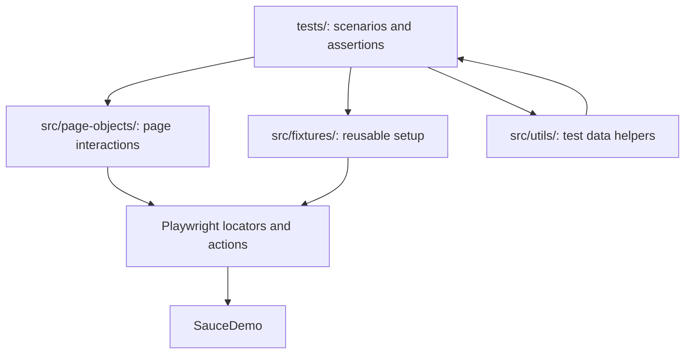
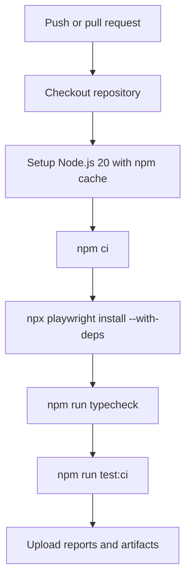

# UI Testing Playwright Framework


Production-style UI test automation framework built with Playwright and TypeScript against the SauceDemo e-commerce application.

This repository is also a learning project. It grows module by module from a first Playwright test into a framework with page objects, fixtures, data-driven tests, advanced browser features, reporting, CI, and a capstone regression suite.

## Modular Learning Structure

This project is intentionally organized as a linear learning path. Each module was built on its own branch, then merged into `main` and tagged as a completed checkpoint.

That means you can inspect the framework at any stage of its evolution:

```bash
git tag --list 'module-*' --sort=version:refname
git checkout module-03-complete
git checkout module-07-complete
git checkout module-08-complete
```

To return to the finished project:

```bash
git checkout main
```

Module checkpoints:

| Checkpoint | What The Project Contains At That Point |
|---|---|
| `module-01-complete` | first Playwright test, beginner JavaScript/TypeScript bridge docs |
| `module-02-complete` | Playwright config, npm scripts, environment variables, project structure |
| `module-03-complete` | Page Object Model, base page pattern, locator strategy |
| `module-04-complete` | structured UI/API tests, hooks, assertions, data-driven coverage, tags |
| `module-05-complete` | fixtures, auth state reuse, file handling, dialogs, iframes, network interception |
| `module-06-complete` | HTML/JSON/JUnit/Allure reporting, artifacts, GitHub Actions CI |
| `module-07-complete` | capstone regression suite with 103 logical tests |
| `module-08-complete` | final README, packaging docs, repository polish |

The docs for each module live under `docs/module-*`. They are written to explain the concepts behind the code at that module checkpoint, not just summarize the final state.

## Final Project State

At the final checkpoint, this repository is a complete Playwright + TypeScript automation framework for SauceDemo.

The final framework includes:

- one Playwright configuration with multiple projects
- page objects for SauceDemo login, products, cart, and checkout pages
- typed test users and capstone data
- custom fixtures for reusable setup
- saved authentication state support
- UI tests grouped by business area
- API and API-style tests
- advanced Playwright feature examples
- reporting and CI support
- a larger capstone suite that reuses the framework instead of creating a second project

The important learning point is progression: the final framework did not appear all at once. Each module added one layer, and the capstone proves those layers can support a broader regression suite.

## Application Under Test

The primary application under test is [SauceDemo](https://www.saucedemo.com), a public demo e-commerce application commonly used for UI automation practice.

The framework covers these SauceDemo user journeys:

| Area | User Behavior Covered |
|---|---|
| Authentication | valid users, locked user, invalid credentials, empty field validation |
| Product catalog | product visibility, names, prices, descriptions, sorting, product details |
| Cart | adding items, removing items, item counts, quantities, persistence across navigation |
| Checkout | customer information validation, overview page, totals, finish order, back home flow |
| Menu/session | logout and authenticated state reuse |

SauceDemo does not provide a real public API for all e-commerce operations. The project includes API examples and API-style capstone tests to teach Playwright's API testing style and typed contract thinking, but the main product workflow is UI-driven.

## What This Project Demonstrates

- Playwright test automation with TypeScript
- Page Object Model with reusable page classes
- Base page abstraction for shared page behavior
- Typed test data and environment-backed users
- UI, API-style, advanced browser, reporting, and authenticated-session tests
- Custom fixtures and saved authentication state
- Playwright HTML, JSON, JUnit, and Allure reporting
- GitHub Actions CI with uploaded report artifacts
- A capstone suite covering authentication, products, cart, checkout, and API-style behavior

## Tech Stack

| Tool | Purpose |
|---|---|
| Playwright | Browser automation and test runner |
| TypeScript | Type safety for tests, page objects, fixtures, and data |
| Node.js | Runtime for Playwright and tooling |
| dotenv | Local environment variable loading |
| Allure | Rich test reporting |
| GitHub Actions | Continuous integration |
| SauceDemo | Main UI test target |

## Project Structure

```text
.
├── .github/workflows/        # CI workflow
├── docs/                     # Module-by-module learning docs
├── playwright/.auth/         # Saved auth state, ignored except .gitkeep
├── reports/                  # Generated reports and artifacts, ignored except .gitkeep
├── src/
│   ├── fixtures/             # Custom Playwright fixtures
│   ├── page-objects/         # Page Object Model classes
│   ├── types/                # Shared TypeScript types
│   └── utils/                # Test data and helpers
├── tests/
│   ├── advanced/             # Files, frames, dialogs, network examples
│   ├── api/                  # API and API-style tests
│   ├── learning/             # Module 01 first Playwright test
│   ├── reporting/            # Reporting artifact example
│   ├── setup/                # Auth state setup
│   └── ui/                   # UI tests organized by business area
├── playwright.config.ts      # Playwright projects, reporters, artifacts, and env config
├── package.json              # Scripts and dependencies
└── tsconfig.json             # TypeScript configuration
```

## Architecture

The framework separates test intent from page mechanics.



Key framework files:

| File | Purpose |
|---|---|
| `src/page-objects/BasePage.ts` | Shared page-object behavior |
| `src/page-objects/LoginPage.ts` | Login page interactions and assertions support |
| `src/page-objects/ProductsPage.ts` | Product catalog actions, sorting, cart badge, menu/logout |
| `src/page-objects/CartPage.ts` | Cart item, quantity, removal, and navigation helpers |
| `src/page-objects/CheckoutPage.ts` | Checkout information, overview, totals, and completion helpers |
| `src/fixtures/saucedemo-fixtures.ts` | Custom fixtures for reusable authenticated/cart setup |
| `src/utils/test-users.ts` | Environment-backed SauceDemo users with safe demo fallbacks |
| `src/utils/capstone-data.ts` | Larger typed data set for the capstone suite |

## Test Grouping And Suite Organization

The repository contains both learning-focused tests and capstone tests.

Earlier module tests introduce concepts one at a time. Capstone tests prove the framework can support broader regression coverage. Keeping both categories is intentional: the earlier tests are teaching examples, and the capstone suite is the final broad coverage layer.

Top-level test grouping:

| Group | Path | Purpose |
|---|---|---|
| Learning | `tests/learning/` | Module 01 first-run Playwright example |
| UI domain tests | `tests/ui/auth/`, `tests/ui/products/`, `tests/ui/cart/`, `tests/ui/checkout/` | focused SauceDemo UI coverage from earlier modules |
| UI capstone tests | `tests/ui/capstone/` | expanded final UI regression coverage |
| API tests | `tests/api/` | Playwright API examples and API-style capstone checks |
| Advanced tests | `tests/advanced/` | files, frames, dialogs, and network interception |
| Reporting tests | `tests/reporting/` | report artifact example |
| Auth setup | `tests/setup/` | storage-state setup for authenticated tests |
| Authenticated tests | `tests/ui/authenticated/` | tests that reuse saved login state |

| Area | Location | Purpose |
|---|---|---|
| First Playwright check | `tests/learning/first-run.spec.ts` | Beginner first-run test |
| Login/auth | `tests/ui/auth/` | Core login behavior and data-driven validation |
| Products | `tests/ui/products/` | Product catalog, data checks, fixtures |
| Cart | `tests/ui/cart/` | Cart add/remove behavior |
| Checkout | `tests/ui/checkout/` | Checkout success and validation |
| Authenticated state | `tests/ui/authenticated/` | Storage-state based login reuse |
| Advanced features | `tests/advanced/` | File handling, frames, dialogs, network interception |
| Reporting | `tests/reporting/` | Report artifact attachment example |
| API examples | `tests/api/` | API and API-style coverage |
| Capstone | `tests/ui/capstone/`, `tests/api/capstone/` | Final expanded SauceDemo suite |

Playwright project organization:

| Project | What It Runs |
|---|---|
| `chromium` | normal UI tests on desktop Chrome |
| `firefox` | normal UI tests on desktop Firefox |
| `webkit` | normal UI tests on desktop Safari/WebKit |
| `Mobile Chrome` | mobile UI coverage, excluding capstone UI tests |
| `api` | tests under `tests/api/` |
| `advanced-chromium` | tests under `tests/advanced/` |
| `reporting-chromium` | tests under `tests/reporting/` |
| `auth-setup` | login setup that writes storage state |
| `authenticated-chromium` | tests that depend on saved auth state |

Module 07 capstone coverage:

| Capstone Area | Logical Tests |
|---|---:|
| Authentication | 14 |
| Products | 24 |
| Cart | 23 |
| Checkout | 27 |
| API-style coverage | 15 |
| Total | 103 |

`npm run test:capstone` runs 279 executions because the 88 UI capstone tests run on Chromium, Firefox, and WebKit, while the 15 API-style tests run once in the API project.

## Prerequisites

- Node.js 20 or newer
- npm
- Playwright browsers installed through the project script

## Getting Started

Install dependencies:

```bash
npm install
```

Install Playwright browsers:

```bash
npm run install:browsers
```

Optional: create a local `.env` file from the template:

```bash
cp .env.example .env
```

The project can run without `.env` because SauceDemo uses public demo credentials and the framework has safe fallback values. In a real company project, secrets should be injected through local environment files or CI secrets.

Run a focused login test:

```bash
npm run test:login
```

Run the full configured suite:

```bash
npm run test:ci
```

## Common Commands

| Command | What It Runs |
|---|---|
| `npm run typecheck` | TypeScript check only |
| `npm run test` | Default Playwright test command |
| `npm run test:login` | Login spec |
| `npm run test:smoke` | Tests tagged with `@smoke` |
| `npm run test:chromium` | Browser project: Chromium |
| `npm run test:firefox` | Browser project: Firefox |
| `npm run test:webkit` | Browser project: WebKit |
| `npm run test:mobile` | Mobile Chrome project |
| `npm run test:api` | API project |
| `npm run test:advanced` | Advanced feature tests |
| `npm run test:authenticated` | Auth-state project |
| `npm run test:reporting` | Reporting demo project |
| `npm run test:reporting:allure` | Reporting demo project with Allure results |
| `npm run test:capstone` | Capstone UI and API coverage |
| `npm run test:capstone:ui` | Capstone UI coverage on desktop browsers |
| `npm run test:capstone:api` | Capstone API-style coverage |
| `npm run test:ci` | Full configured suite |

## Running Selective Test Suites

Use npm scripts for the common suites:

```bash
npm run test:login
npm run test:smoke
npm run test:capstone
npm run test:capstone:ui
npm run test:capstone:api
npm run test:advanced
npm run test:reporting
npm run test:authenticated
```

Use Playwright directly when you want one file, one folder, one project, or one title pattern:

```bash
npx playwright test tests/ui/products/products.spec.ts
npx playwright test tests/ui/cart
npx playwright test --project=chromium
npx playwright test --project=api
npx playwright test --grep @smoke
npx playwright test --grep "checkout"
```

Useful selection patterns:

| Goal | Command |
|---|---|
| Run one spec file | `npx playwright test tests/ui/auth/login.spec.ts` |
| Run one folder | `npx playwright test tests/ui/capstone/products` |
| Run one browser project | `npx playwright test --project=firefox` |
| Run API project only | `npm run test:api` |
| Run capstone API only | `npm run test:capstone:api` |
| Run tests tagged smoke | `npm run test:smoke` |
| Run headed for debugging | `npm run test:headed` |
| Open Playwright UI mode | `npm run test:ui` |
| Debug a specific file | `npx playwright test tests/ui/auth/login.spec.ts --debug` |

## Reports

The framework writes reports under `reports/`.

| Report | Path |
|---|---|
| Playwright HTML report | `reports/playwright-html` |
| JSON results | `reports/test-results/results.json` |
| JUnit XML | `reports/test-results/junit.xml` |
| Allure raw results | `reports/allure-results` |
| Generated Allure report | `reports/allure-report` |
| Screenshots, videos, traces, attachments | `reports/test-artifacts` |

Open the Playwright HTML report:

```bash
npm run report
```

Generate and open an Allure report:

```bash
npm run test:reporting:allure
npm run allure:generate
npm run allure:open
```

Generate Allure from a full run:

```bash
npm run test:ci
npm run allure:generate
npm run allure:open
```

For a clean report run:

```bash
rm -rf reports/allure-results reports/allure-report reports/playwright-html reports/test-results reports/test-artifacts
npm run test:ci
npm run allure:generate
```

Generated reports and artifacts are ignored by Git.

## CI

GitHub Actions is configured in:

```text
.github/workflows/playwright.yml
```

The workflow is named `Playwright Tests`. It runs on:

- pushes to `main`
- pushes to any `module-*` branch
- pull requests targeting `main`

This matches the learning workflow: every module branch can be validated before it is merged, and `main` stays a completed checkpoint.

The CI job runs on Ubuntu and uses Node.js 20. It also sets the same SauceDemo values documented in `.env.example`, so CI does not depend on a local `.env` file.

CI execution flow:



What `npm run test:ci` runs:

| Playwright Project | Included Tests |
|---|---|
| `chromium` | standard UI specs, including capstone UI, except ignored setup/API/advanced/reporting/authenticated areas |
| `firefox` | same standard UI coverage on Firefox |
| `webkit` | same standard UI coverage on WebKit |
| `Mobile Chrome` | mobile UI coverage, excluding capstone UI tests |
| `api` | `tests/api/**/*.spec.ts`, including capstone API-style tests |
| `advanced-chromium` | file handling, iframe/dialog, and network interception specs |
| `reporting-chromium` | reporting artifact spec |
| `auth-setup` | creates saved login state |
| `authenticated-chromium` | tests that depend on saved auth state |

At the Module 08 checkpoint, this full CI command runs 391 Playwright executions.

The workflow uploads these generated outputs even if a test fails:

| Artifact Path | Why It Matters |
|---|---|
| `reports/playwright-html` | interactive Playwright report for debugging |
| `reports/test-results` | JSON and JUnit result files |
| `reports/allure-results` | raw Allure result files |
| `reports/test-artifacts` | screenshots, traces, videos, downloads, and attachments |

CI does not commit reports back to the repository. Reports are generated evidence for a specific run, so they are uploaded as workflow artifacts and ignored by Git.

## Module Learning Path

The framework was built in eight modules:

| Module | Topic | Docs |
|---|---|---|
| 01 | Getting Started with Playwright | `docs/module-01-getting-started/` |
| 02 | Framework Foundation | `docs/module-02-framework-foundation/` |
| 03 | Page Object Model | `docs/module-03-page-object-model/` |
| 04 | Writing Tests | `docs/module-04-writing-tests/` |
| 05 | Advanced Features | `docs/module-05-advanced-features/` |
| 06 | Reporting and CI/CD | `docs/module-06-reporting-cicd/` |
| 07 | Capstone Real World Project | `docs/module-07-capstone/` |
| 08 | Portfolio and Repository Packaging | `docs/module-08-portfolio-and-interview-packaging/` |

The docs are intended to teach the concepts behind the code, not just list files.

## Environment Variables

Supported variables are documented in `.env.example`.

| Variable | Default |
|---|---|
| `BASE_URL` | `https://www.saucedemo.com` |
| `SAUCEDEMO_STANDARD_USER` | `standard_user` |
| `SAUCEDEMO_LOCKED_USER` | `locked_out_user` |
| `SAUCEDEMO_PROBLEM_USER` | `problem_user` |
| `SAUCEDEMO_PERFORMANCE_USER` | `performance_glitch_user` |
| `SAUCEDEMO_ERROR_USER` | `error_user` |
| `SAUCEDEMO_VISUAL_USER` | `visual_user` |
| `SAUCEDEMO_PASSWORD` | `secret_sauce` |

The local `.env` file is intentionally ignored by Git.

## Repository Hygiene

Tracked:

- source code
- tests
- docs
- config
- workflows
- examples/templates such as `.env.example`

Ignored:

- `node_modules/`
- local `.env` files
- generated reports
- screenshots, videos, traces, and downloads
- generated auth state under `playwright/.auth/`

## Verification Snapshot

At the Module 07 checkpoint, the following gates passed:

```text
npm run typecheck
npm run test:capstone
npm run test:ci
```

Observed results:

- `npm run test:capstone`: 279 passed
- `npm run test:ci`: 391 passed

These numbers can change if new tests or projects are added later.
