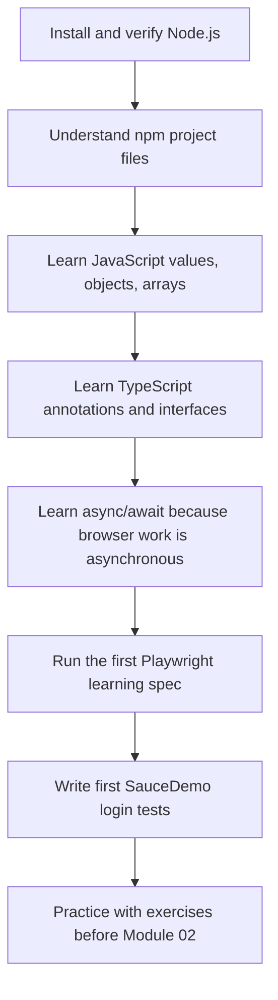
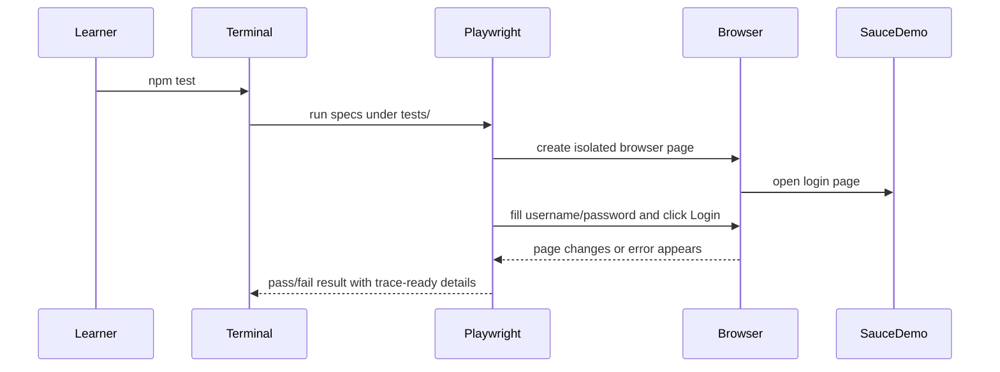

# Module 01: Getting Started with Playwright

## What This Module Builds

Module 01 creates the first working Playwright + TypeScript project and teaches the language concepts needed to understand every line of the first specs.

The source curriculum introduces Playwright quickly: install Node.js, create a project, run a sample test, and understand why Playwright is reliable. This repository keeps that goal, but adds a beginner bridge for JavaScript and TypeScript because later modules depend on those concepts.

By the end of this module you should be able to:

- explain why Playwright needs Node.js and npm
- read a basic TypeScript test without treating it as magic
- run Playwright specs from the terminal
- understand the role of `test`, `expect`, `page`, locators, actions, and assertions
- write a simple SauceDemo login test with both a passing and failing path
- debug beginner failures such as a missing `await`, wrong selector, or wrong expectation

## Module 01 Learning Flow



The order matters. A beginner who jumps straight into `await page.getByRole(...).click()` sees one long chain of symbols. This module separates that chain into pieces:

- `await` means "pause this test step until the browser action finishes"
- `page` is the browser tab object Playwright gives the test
- `getByRole(...)` creates a locator that describes a UI element
- `click()` performs an action on that locator

## Files Introduced In This Module

| File | Purpose | Why It Exists Now |
|---|---|---|
| `package.json` | npm manifest and test scripts | Defines this as a Node.js project and records Playwright dependencies |
| `package-lock.json` | exact dependency lockfile | Keeps installs repeatable across machines |
| `tsconfig.json` | TypeScript compiler settings | Enables strict enough checking for a learning framework |
| `playwright.config.ts` | Playwright runner configuration | Defines test location, browser behavior, reports, retries, and base URL |
| `.gitignore` | ignored generated files | Keeps `node_modules`, reports, and secrets out of commits |
| `tests/learning/first-run.spec.ts` | first low-risk learning spec | Demonstrates `test`, `page`, navigation, and assertions |
| `tests/ui/auth/login.spec.ts` | first real target spec | Exercises SauceDemo login success and login failure |
| `docs/module-01-getting-started/*` | learning notes and exercises | Teaches the concepts before the framework grows |

These files are intentionally small. Module 01 is not the framework architecture module. Its job is to make the first feedback loop clear:



## What Is Playwright?

Playwright is a browser automation and test runner tool. In practical SDET terms, it lets your code act like a user:

- open a web page
- find a field or button
- type or click
- wait for the UI to respond
- assert that the right thing happened

Playwright is valuable because it handles many timing problems that older UI tools made you solve manually. When you write:

```ts
await page.getByRole('button', { name: 'Login' }).click();
```

Playwright does more than "click immediately." It waits until the element is attached, visible, stable enough, and able to receive input. This auto-waiting is one reason Playwright tests are less flaky when written with good locators and clear assertions.

## How This Module Differs From A Generated Playwright Project

The command `npm init playwright@latest` can generate a project quickly. That is useful, but generated projects contain example tests that are not shaped like this learning repo.

This repo intentionally uses:

- a stable folder layout from the beginning
- SauceDemo as the main target instead of a temporary demo-only project
- TypeScript from Module 01 onward
- docs that explain the code in the repo, not only generic Playwright concepts
- a branch-per-module history so each completed module is a checkpoint

## Concepts Covered

| Topic | Covered In | Connected Code |
|---|---|---|
| Node.js and npm | `04-project-setup-and-first-tests.md` | `package.json`, `package-lock.json` |
| TypeScript basics | `01-javascript-typescript-basics.md` | all `.ts` files |
| Functions and imports | `02-control-flow-functions-and-modules.md` | `tests/**/*.spec.ts` imports from `@playwright/test` |
| Async browser flow | `03-async-await-and-playwright-flow.md` | every `await page...` call |
| Playwright primitives | `05-core-playwright-primitives.md` | `test`, `expect`, `page`, locators |
| First real test | `06-first-saucedemo-test.md` | `tests/ui/auth/login.spec.ts` |

## What Is Not Added Yet

The following topics are deliberately delayed:

- environment variables and reusable test users: Module 02
- page object classes: Module 03
- richer test organization, hooks, data-driven tests, and API testing: Module 04
- fixtures, saved authentication, file handling, frames, dialogs, and network mocking: Module 05
- CI, reports, traces, screenshots, and Allure: Module 06

Keeping those out of Module 01 matters. A beginner should first understand one spec file and one config file before the framework gains abstractions.

## Quality Gate For Module 01

Module 01 is complete when:

- dependencies install with `npm install`
- TypeScript compiles with `npm run typecheck`
- the first learning and login specs run with `npm test`
- docs explain the concepts used by the code
- exercises ask the learner to extend or inspect Module 01 behavior, not repeat hidden future-module work

## Key Takeaways

- Playwright tests are TypeScript programs that control real browsers.
- Every Playwright action is asynchronous because browser state changes over time.
- Locators describe what the test wants to interact with; actions and assertions use those locators.
- Module 01 keeps code intentionally direct so the learner can understand the raw Playwright API before page objects and fixtures appear later.
