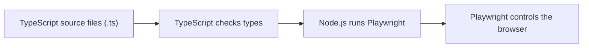

# JavaScript And TypeScript Basics For UI Automation

## Why A UI Tester Needs Language Fundamentals

Playwright is not a record-and-playback tool in this framework. It is code. Every test depends on ordinary programming ideas:

- names that point to values
- objects that group related data
- arrays that hold lists
- functions that reuse behavior
- types that describe what shape data should have

If those fundamentals are weak, Playwright syntax feels like a collection of special commands. If they are solid, Playwright becomes easier: you are using TypeScript to describe browser behavior.

## JavaScript vs TypeScript

JavaScript is the language that runs in Node.js and browsers.

TypeScript is JavaScript with a type-checking layer. TypeScript helps your editor and compiler catch mistakes before the test starts.



Practical example:

```ts
await page.waitForTimeout(1000);
```

The method expects a number. TypeScript can warn if you accidentally pass text:

```ts
await page.waitForTimeout('1000'); // wrong: string instead of number
```

That early warning is useful in automation because many failures are simple mismatches: wrong data shape, wrong method argument, missing property, or forgotten import.

## Values And Variables

A value is a piece of data. A variable is a name that points to a value.

```ts
const baseUrl = 'https://www.saucedemo.com';
const validUsername = 'standard_user';
const validPassword = 'secret_sauce';
let loginAttempts = 0;
```

Use `const` by default. Use `let` only when the value needs to be reassigned.

```ts
const username = 'standard_user';

let retryCount = 0;
retryCount = retryCount + 1;
```

In test automation, `const` is preferred because test data should not silently change halfway through a test.

## `const` Does Not Freeze Objects

This detail matters later when test data becomes shared.

```ts
const user = {
  username: 'standard_user',
  password: 'secret_sauce',
};

user.password = 'wrong_password'; // allowed
```

`const` prevents assigning a completely different object to `user`, but it does not freeze the object's internal properties.

```ts
const user = { username: 'standard_user' };

user = { username: 'locked_out_user' }; // not allowed
```

When shared objects arrive in later modules, avoid mutating them inside tests. If a test modifies shared data, another test may inherit surprising state.

## Primitive Types

Primitive values are the simplest building blocks.

```ts
const username: string = 'standard_user';
const productCount: number = 6;
const loginSucceeded: boolean = true;
const optionalCouponCode: null = null;
let notAssignedYet: undefined;
```

### Strings

Strings hold text:

```ts
const loginButtonName = 'Login';
const inventoryPath = '/inventory.html';
const loginError = 'Epic sadface: Username and password do not match any user in this service';
```

Backtick strings can include values:

```ts
const productName = 'Sauce Labs Backpack';
const assertionMessage = `Expected ${productName} to be visible`;
```

This becomes useful when a failure message or test title includes dynamic data.

### Numbers

JavaScript uses one `number` type for integers and decimals.

```ts
const expectedProductCount = 6;
const backpackPrice = 29.99;
const timeoutMs = 30_000;
```

The underscore in `30_000` is just a readability separator. It still equals `30000`.

### Booleans

Booleans represent true or false.

```ts
const shouldBeVisible = true;
const isLockedOutUser = false;
```

You usually get booleans from comparisons or helper methods:

```ts
const isInventoryUrl = '/inventory.html'.includes('inventory');
const hasProducts = expectedProductCount > 0;
```

### `null` And `undefined`

Both mean "there is no useful value here," but they are not the same.

Use `null` when absence is intentional:

```ts
const selectedProduct: string | null = null;
```

`undefined` often means something was not assigned or a property does not exist.

```ts
const user = { username: 'standard_user' };
const password = user.password; // undefined at runtime in plain JavaScript
```

TypeScript helps catch missing properties before runtime when object shapes are typed.

## Type Annotations And Inference

A type annotation tells TypeScript what kind of value is expected.

```ts
const username: string = 'standard_user';
const maxRetries: number = 2;
const shouldRetry: boolean = false;
```

TypeScript can infer simple types:

```ts
const username = 'standard_user'; // inferred as string
const maxRetries = 2; // inferred as number
```

Use explicit annotations when they clarify the contract:

```ts
function buildInventoryUrl(baseUrl: string): string {
  return `${baseUrl}/inventory.html`;
}
```

This function promises it accepts a `string` and returns a `string`. That contract is useful when functions become framework helpers.

## Arrays

An array is an ordered list.

```ts
const productNames: string[] = [
  'Sauce Labs Backpack',
  'Sauce Labs Bike Light',
  'Sauce Labs Bolt T-Shirt',
];
```

Common operations:

```ts
const firstProduct = productNames[0];
const productCount = productNames.length;
const hasBackpack = productNames.includes('Sauce Labs Backpack');
```

Important nuance: array indexes can return `undefined`.

```ts
const missingProduct = productNames[99]; // undefined at runtime
```

This matters in UI tests. If the page did not render the expected product, code that assumes `productNames[0]` exists can fail later with a confusing error. Prefer assertions that prove the page is in the expected state before reading details from it.

## Objects

Objects group related values.

```ts
const standardUser = {
  username: 'standard_user',
  password: 'secret_sauce',
};
```

Access properties with dot syntax:

```ts
const username = standardUser.username;
```

Objects are ideal for test data:

```ts
const lockedOutUser = {
  username: 'locked_out_user',
  password: 'secret_sauce',
  expectedError: 'Epic sadface: Sorry, this user has been locked out.',
};
```

The object keeps the username, password, and expected result together, which reduces mismatches.

## Object Types

TypeScript can define the shape of an object.

```ts
type TestUser = {
  username: string;
  password: string;
  expectedError?: string;
};
```

The `?` means the property is optional.

```ts
const standardUser: TestUser = {
  username: 'standard_user',
  password: 'secret_sauce',
};

const lockedOutUser: TestUser = {
  username: 'locked_out_user',
  password: 'secret_sauce',
  expectedError: 'Epic sadface: Sorry, this user has been locked out.',
};
```

If you misspell a property, TypeScript can catch it:

```ts
const user: TestUser = {
  userName: 'standard_user', // wrong property name
  password: 'secret_sauce',
};
```

This kind of mistake is common when framework data grows. TypeScript turns it into a compile-time issue instead of a runtime mystery.

## Interfaces And `readonly`

An interface also describes object shape.

```ts
interface LoginCredentials {
  readonly username: string;
  readonly password: string;
}
```

`readonly` means code should not reassign that property:

```ts
const credentials: LoginCredentials = {
  username: 'standard_user',
  password: 'secret_sauce',
};

credentials.password = 'wrong_password'; // TypeScript error
```

For automation data, `readonly` is useful because credentials and expected product names should act like fixtures, not mutable scratch variables.

## Type Aliases vs Interfaces

For beginners, both are acceptable for object shapes.

Use a simple rule in this repo:

- `type` is fine for small data shapes and unions
- `interface` is fine for named object contracts that classes or helpers may consume

Later modules use shared types in `src/types/` so test data and page objects agree on the same shape.

## Union Types

A union means a value can be one of several types or literal values.

```ts
type SortOrder = 'az' | 'za' | 'price-low-high' | 'price-high-low';
```

This is stronger than a plain string:

```ts
const sortOrder: SortOrder = 'az'; // allowed
const wrongSortOrder: SortOrder = 'newest'; // TypeScript error
```

Union types are useful for UI controls with known options, such as product sort order.

## How This Connects To Module 01 Code

The first real spec uses simple values directly:

```ts
const username = 'standard_user';
const password = 'secret_sauce';
```

That is fine in Module 01 because the goal is clarity. In Module 02, these values move into reusable typed test data. In Module 03, methods such as `loginPage.login(username, password)` rely on function parameters and object-oriented structure.

The language concepts in this file are not separate from Playwright. They are the foundation under every future page object, fixture, data-driven test, and API helper.

## Beginner Checklist

Before continuing, make sure you can answer:

- What is the difference between `const` and `let`?
- Why does TypeScript help before a test runs?
- What is the difference between a string and a number?
- Why are arrays indexed from `0`?
- Why is mutating shared test data risky?
- What does `readonly` protect?
