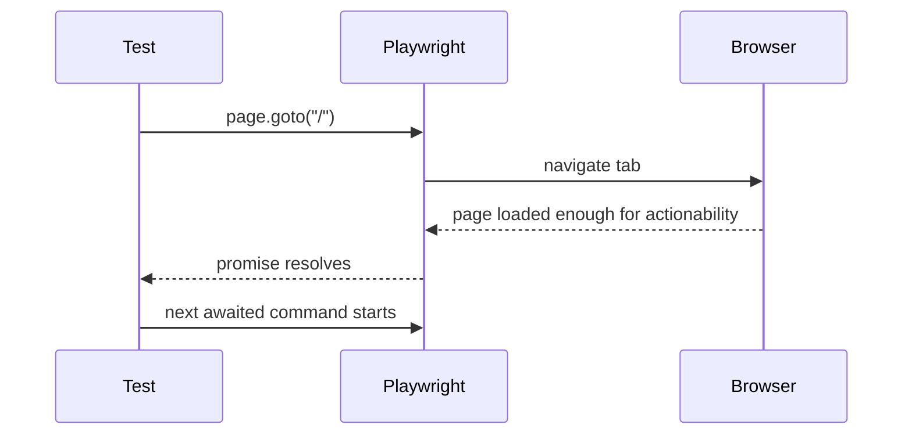

# Async/Await And Playwright Flow

## The Core Idea

Browser automation is asynchronous because the browser is doing work outside your test process.

When a test clicks a button, the result is not instant:

- the browser receives the click
- JavaScript event handlers run
- network calls may start
- the DOM may update
- the URL may change
- visible text may appear or disappear

Your test must wait for the right moments. That is why Playwright code uses `async` and `await`.

```ts
test('logs in successfully', async ({ page }) => {
  await page.goto('/');
  await page.getByPlaceholder('Username').fill('standard_user');
  await page.getByPlaceholder('Password').fill('secret_sauce');
  await page.getByRole('button', { name: 'Login' }).click();
  await expect(page).toHaveURL(/inventory.html/);
});
```

## Promise Mental Model

A Promise represents work that will finish later.



`await` tells TypeScript:

"Do not continue to the next line until this asynchronous operation has finished or failed."

Without `await`, the test may race ahead.

```ts
page.getByRole('button', { name: 'Login' }).click(); // missing await
await expect(page).toHaveURL(/inventory.html/);
```

That code starts the click but does not wait for it. The assertion may run before the click has caused navigation.

## Why The Test Function Is `async`

You can only use `await` inside an `async` function.

```ts
test('opens a page', async ({ page }) => {
  await page.goto('/');
});
```

The `async` keyword does not mean "run faster." It means the function is allowed to pause at `await` points and resume later.

## Auto-Waiting Is Not Magic

Playwright auto-waits for actionability before many actions:

- attached to the DOM
- visible
- stable
- enabled
- able to receive input

Example:

```ts
await page.getByRole('button', { name: 'Login' }).click();
```

Playwright will not blindly click a hidden or detached button. It waits until the locator resolves to an actionable element, then clicks.

But auto-waiting does not mean "assert anything eventually without clear expectations." You still need strong assertions:

```ts
await expect(page).toHaveURL(/inventory.html/);
await expect(page.getByText('Products')).toBeVisible();
```

Those assertions explain what success means.

## Actions vs Assertions

Actions change the page.

```ts
await page.goto('/');
await page.getByPlaceholder('Username').fill('standard_user');
await page.getByRole('button', { name: 'Login' }).click();
```

Assertions verify the page.

```ts
await expect(page).toHaveTitle(/Swag Labs/);
await expect(page.getByText('Products')).toBeVisible();
```

Most useful tests alternate between:

1. arrange state
2. act like a user
3. assert outcome

## Assertion Waiting

Playwright assertions also wait.

```ts
await expect(page.getByText('Products')).toBeVisible();
```

This does not check only once. It retries until the text becomes visible or the assertion timeout expires. This is a major difference from manual sleeps.

Avoid this pattern:

```ts
await page.waitForTimeout(3000);
await expect(page.getByText('Products')).toBeVisible();
```

A fixed sleep is slower when the page is fast and still flaky when the page is slower than expected. Prefer waiting for the actual condition.

## Common Beginner Mistakes

### Missing `await`

```ts
page.goto('/');
await expect(page).toHaveTitle(/Swag Labs/);
```

The navigation started but the assertion may run too early.

### Awaiting A Locator Creation

```ts
const loginButton = await page.getByRole('button', { name: 'Login' }); // unnecessary
```

Creating a locator is not a browser action. A locator is a description of how to find an element. Await the action or assertion that uses it:

```ts
const loginButton = page.getByRole('button', { name: 'Login' });
await loginButton.click();
```

### Using Sleeps Instead Of Conditions

```ts
await page.waitForTimeout(5000);
```

This should be rare. Use URL, text, visibility, request, or response conditions instead.

## How This Connects To Later Modules

Module 03 page objects still use `async` methods:

```ts
async login(username: string, password: string): Promise<void> {
  await this.usernameInput.fill(username);
  await this.passwordInput.fill(password);
  await this.loginButton.click();
}
```

The abstraction changes, but the asynchronous flow is the same. If Module 01's async model is clear, page objects and fixtures become much easier.

## Key Takeaways

- Browser actions are asynchronous because the browser changes over time.
- `async` allows a function to use `await`.
- `await` keeps test steps in the intended order.
- Locators are lazy descriptions; actions and assertions are awaited.
- Prefer waiting for real conditions over fixed timeouts.
