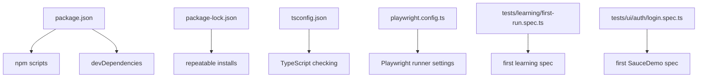

# Project Setup And First Tests

## What Node.js Does In This Project

Node.js lets JavaScript and TypeScript tooling run outside the browser. Playwright's test runner, TypeScript compiler, npm scripts, and dependency installation all use Node.js.

Check the installed versions:

```bash
node --version
npm --version
```

For this project, Node.js 18 or newer is expected.

## What npm Does

npm has two jobs here:

- install packages such as `@playwright/test` and `typescript`
- run scripts defined in [package.json](../../package.json)

When you run:

```bash
npm install
```

npm reads [package.json](../../package.json), downloads dependencies into `node_modules`, and records exact versions in [package-lock.json](../../package-lock.json).

When you run:

```bash
npm test
```

npm looks inside [package.json](../../package.json) and runs the command assigned to the `test` script.

## Files Created In Module 01



## [package.json](../../package.json)

This file declares the project as a Node.js project.

Key sections:

```json
{
  "scripts": {
    "test": "playwright test",
    "test:headed": "playwright test --headed",
    "test:debug": "playwright test --debug",
    "typecheck": "tsc --noEmit"
  },
  "devDependencies": {
    "@playwright/test": "...",
    "typescript": "..."
  }
}
```

The scripts are deliberately small in Module 01. Module 02 expands scripts after the project has environment config and a clearer folder structure.

## [tsconfig.json](../../tsconfig.json)

TypeScript settings live here. The important Module 01 idea is not every individual compiler option. It is that TypeScript checks the project before runtime.

The command:

```bash
npm run typecheck
```

should pass before a module is considered healthy.

## [playwright.config.ts](../../playwright.config.ts)

This file configures the Playwright test runner.

Module 01 keeps it beginner-friendly:

- tests live under `tests/`
- browser runs headless by default
- `baseURL` points to SauceDemo
- reports go under `reports/`
- traces are collected on retry

`baseURL` lets specs use:

```ts
await page.goto('/');
```

instead of repeating:

```ts
await page.goto('https://www.saucedemo.com/');
```

That small decision becomes more important in Module 02 when environment configuration is introduced.

## First Learning Spec

[tests/learning/first-run.spec.ts](../../tests/learning/first-run.spec.ts) exists to prove the runner works before touching a business flow.

It demonstrates:

- importing `test` and `expect`
- receiving the `page` fixture
- navigating to a page
- asserting title and visible content

This is lower risk than starting immediately with a multi-step login flow.

## First Real Spec

[tests/ui/auth/login.spec.ts](../../tests/ui/auth/login.spec.ts) targets SauceDemo directly.

It covers:

- successful login with `standard_user`
- failed login with an invalid password
- visible error assertion

This is the first real UI workflow in the framework, but it intentionally does not use page objects or shared users yet. Those abstractions arrive after the raw Playwright flow is understood.

## Running Module 01

Install dependencies:

```bash
npm install
```

Install browsers if needed:

```bash
npx playwright install
```

Run all Module 01 tests:

```bash
npm test
```

Run headed:

```bash
npm run test:headed
```

Run TypeScript checking:

```bash
npm run typecheck
```

## Debugging Basics

Use debug mode when you want to step through a test:

```bash
npm run test:debug
```

Useful beginner debugging questions:

- Did the page navigate to the expected URL?
- Did the locator match the element you think it matched?
- Did you forget `await` before an action or assertion?
- Is the assertion checking the actual user-visible result?

## Key Takeaways

- [package.json](../../package.json) defines commands and dependencies.
- [package-lock.json](../../package-lock.json) keeps dependency versions repeatable.
- [tsconfig.json](../../tsconfig.json) makes TypeScript check the code.
- [playwright.config.ts](../../playwright.config.ts) controls how tests run.
- Module 01 keeps the config small so the first test feedback loop is easy to reason about.
