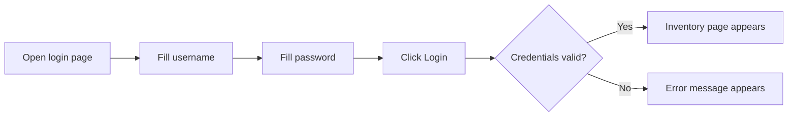

# First SauceDemo Login Test

## Why SauceDemo

SauceDemo is a public demo ecommerce app designed for automation practice. It gives us stable login credentials, product pages, cart behavior, and checkout flows without needing to build our own app.

Module 01 only uses the login screen. Later modules expand into inventory, cart, checkout, fixtures, reporting, and CI.

## The User Flow



The first spec covers both branches:

- valid user + valid password leads to inventory
- valid user + invalid password shows an error

## Why Keep The Test Direct In Module 01

The login test in [tests/ui/auth/login.spec.ts](../../tests/ui/auth/login.spec.ts) uses raw Playwright calls:

```ts
await page.getByPlaceholder('Username').fill('standard_user');
await page.getByPlaceholder('Password').fill('secret_sauce');
await page.getByRole('button', { name: 'Login' }).click();
```

This is intentional. A page object would make the test shorter, but it would hide the primitives too early. Module 03 introduces page objects after you have seen the repeated behavior clearly.

## Success Path

The success test should prove two things:

1. the app navigated to inventory
2. the inventory page is actually visible to the user

Example assertions:

```ts
await expect(page).toHaveURL(/inventory.html/);
await expect(page.getByText('Products')).toBeVisible();
```

The URL assertion catches navigation. The visible text assertion catches user-facing page state.

## Failure Path

The negative login test proves the app rejects bad credentials.

```ts
await page.getByPlaceholder('Username').fill('standard_user');
await page.getByPlaceholder('Password').fill('incorrect_password');
await page.getByRole('button', { name: 'Login' }).click();

await expect(page.locator('[data-test="error"]')).toContainText(
  'Username and password do not match'
);
```

The selector `[data-test="error"]` is a CSS attribute selector. It means:

"Find an element whose `data-test` attribute equals `error`."

This is stable because it targets an attribute intended for testing rather than a visual CSS class.

## Why Not Assert Only The URL

A successful login assertion that only checks the URL is incomplete:

```ts
await expect(page).toHaveURL(/inventory.html/);
```

The URL might change while the page content is broken. A better beginner pattern is:

```ts
await expect(page).toHaveURL(/inventory.html/);
await expect(page.getByText('Products')).toBeVisible();
```

This combines application route and user-visible content.

## Debugging The Login Test

If the success login test fails:

- confirm SauceDemo is reachable in the browser
- check that the username is `standard_user`
- check that the password is `secret_sauce`
- confirm `await` appears before every action
- run headed mode to see the browser

```bash
npm run test:headed -- tests/ui/auth/login.spec.ts
```

If the negative test fails:

- inspect whether the app changed the error wording
- confirm the selector `[data-test="error"]` still exists
- avoid asserting the full message unless the exact text is important

## What This Test Teaches For Later Modules

The same login behavior evolves through the course:

| Module | How Login Is Represented |
|---|---|
| Module 01 | raw Playwright calls inside the spec |
| Module 02 | credentials come from reusable typed test data |
| Module 03 | login behavior moves into `LoginPage` |
| Module 04 | login tests become better organized and data-driven |
| Module 05 | saved authentication avoids repeating login for every authenticated test |

The behavior stays familiar. The framework around it becomes more capable.

## Key Takeaways

- A useful UI test checks both action and visible outcome.
- Positive and negative paths teach different risks.
- Stable attributes such as `data-test` are often better than CSS classes.
- Module 01 keeps the code explicit so the raw Playwright flow is easy to learn.
