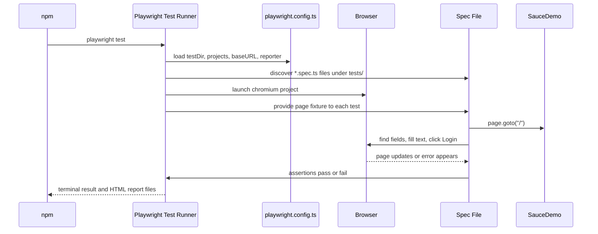

# Module 01 Framework Lifecycle Deep Dive

## Mental Model

At this checkpoint the framework is intentionally a thin wrapper around Playwright's test runner.

Think of it like a driving lesson before you learn traffic systems. You are not building reusable page objects yet. You are learning how the car responds when you steer, brake, and accelerate:

- [package.json](../../package.json) gives you the terminal commands.
- [playwright.config.ts](../../playwright.config.ts) tells Playwright where tests live and how to launch the browser.
- [tests/learning/first-run.spec.ts](../../tests/learning/first-run.spec.ts) proves the runner can open SauceDemo and inspect the login page.
- [tests/ui/auth/login.spec.ts](../../tests/ui/auth/login.spec.ts) performs the first real business workflow: successful and failed login.

The important beginner idea is that a Playwright test is ordinary TypeScript code running in Node.js, but it controls a browser through the `page` object. Each browser action takes time, so the test uses `await` to keep the steps in the same order a human user would perform them.

## Execution Flow

When you run `npm test`, the flow is:



The `baseURL` in [playwright.config.ts](../../playwright.config.ts) is why the specs can call `page.goto('/')`. The slash is resolved to `https://www.saucedemo.com/`.

## Code Walkthrough

Start with [package.json](../../package.json). The scripts are small on purpose:

- `npm test` runs every spec through Playwright.
- `npm run test:headed` opens a visible browser.
- `npm run test:debug` opens Playwright's debugger.
- `npm run typecheck` asks TypeScript to check the project without generating JavaScript files.

Then read [tsconfig.json](../../tsconfig.json). The most important beginner setting is `strict: true`. It makes TypeScript complain earlier when values, imports, or function shapes do not line up.

Next read [playwright.config.ts](../../playwright.config.ts). Module 01 config has one browser project, `chromium`, and one test root, [./tests](../../tests). The runner also writes generated output under `reports/`, which is ignored by Git because reports are build artifacts, not source code.

The first spec, [tests/learning/first-run.spec.ts](../../tests/learning/first-run.spec.ts), is the smallest complete example:

```ts
test('login form is visible on the SauceDemo landing page', async ({ page }) => {
  const loginPageTitle: string = 'Swag Labs';

  await page.goto('/');
  await expect(page).toHaveTitle(loginPageTitle);
});
```

That one test already contains the core shape of most Playwright tests:

1. Declare a test with `test(...)`.
2. Receive the `page` fixture from Playwright.
3. Navigate to a target page.
4. Assert a user-visible outcome with `expect(...)`.

The real workflow spec, [tests/ui/auth/login.spec.ts](../../tests/ui/auth/login.spec.ts), adds a positive and negative path. The success path fills credentials and verifies that the inventory page appears. The failure path intentionally enters a bad password and verifies that SauceDemo shows an error message.

## TypeScript And Framework Syntax To Notice

`import { expect, test } from '@playwright/test';` uses a named import. It means the spec only imports the two exports it needs from Playwright's test package.

`async ({ page }) => { ... }` is an async arrow function. The `{ page }` part is destructuring: Playwright gives the test a fixture object, and the test pulls out only the `page` property.

`await page.goto('/')` pauses the test until navigation is complete enough for Playwright to continue. Without `await`, the next line could run before the page is ready.

`const loginPageTitle: string = 'Swag Labs';` is a typed constant. TypeScript knows this value should be a string. This is simple here, but the habit matters later when test data and page objects grow.

`page.getByRole('button', { name: 'Login' })` creates a locator based on how a user or assistive technology understands the page. Role-based locators are often more meaningful than CSS selectors when the UI has accessible names.

`page.locator('[data-test="error"]')` uses a CSS attribute selector. It is appropriate here because SauceDemo exposes stable `data-test` attributes specifically for automation.

If you are coming from Java, map the ideas this way:

- `const` is closer to a local `final` variable than a mutable variable.
- `async`/`await` is how this TypeScript code handles asynchronous browser work without nested callbacks.
- `test.describe(...)` groups related tests, similar to a test class grouping related test methods.
- `expect(...)` is the assertion API, similar in purpose to assertions from JUnit, TestNG, or AssertJ.

## Responsibility Boundaries

Module 01 has very few layers, and that is the point.

The config file is responsible for runner behavior: browser, timeouts, reports, retries, and base URL.

Spec files are responsible for test behavior: navigation, user actions, and assertions.

The docs are responsible for explaining the concepts that appear in the current code.

The empty folders under `src/` and domain folders under [tests/ui/](../../tests/ui) show the future framework shape, but Module 01 should not put reusable framework logic there yet. Reuse appears after the learner has seen enough duplication to understand why abstraction helps.

## Common Mistakes

Forgetting `await` is the most common beginner failure. Browser automation is asynchronous, so actions and assertions should normally be awaited.

Using brittle selectors is another early risk. Prefer user-facing locators such as `getByRole` and `getByPlaceholder` when they clearly describe the page. Use `data-test` selectors when the application provides stable automation attributes.

Asserting only a URL can miss a broken screen. A better Module 01 pattern is to assert both navigation and visible content.

Putting credentials, helper functions, or page object classes into `src/` too early makes Module 01 harder to learn. This checkpoint intentionally keeps the flow visible inside the spec.

## Debugging And Failure Model

If a test fails before opening the browser, check installation and TypeScript first:

```bash
npm install
npm run typecheck
```

If the browser opens but cannot reach the app, check that SauceDemo is reachable and that [playwright.config.ts](../../playwright.config.ts) still has the correct `baseURL`.

If a locator fails, run headed or debug mode:

```bash
npm run test:headed -- tests/ui/auth/login.spec.ts
npm run test:debug -- tests/ui/auth/login.spec.ts
```

If an assertion times out, ask what user-visible state the app actually reached. A timeout usually means Playwright kept waiting for the expected state, but the page never matched it.

## Interview Readiness

Be ready to explain why Module 01 does not use page objects yet. The answer is that a framework should teach and prove the raw browser interaction model before hiding it behind abstractions.

You should also be able to explain Playwright auto-waiting. A click is not a blind command; Playwright checks whether the element can be acted on before performing the action.

A strong interview answer for this checkpoint:

"I started with direct Playwright specs so the basic execution model was visible: the runner loads config, creates an isolated `page`, navigates using `baseURL`, performs actions with locators, and verifies outcomes with web-first assertions. I delayed page objects until the login flow was understood and repeated enough to justify abstraction."

## Revision Checklist

Before moving beyond Module 01, confirm you can answer these without reading the code:

- What does `npm test` run?
- Why does `page.goto('/')` open SauceDemo?
- What object does Playwright inject into each test?
- Why do actions and assertions use `await`?
- What is the difference between `getByRole`, `getByPlaceholder`, and `locator('[data-test="..."]')`?
- Why does the login spec test both success and failure?
- Which files are source files, and which generated files should stay out of Git?
