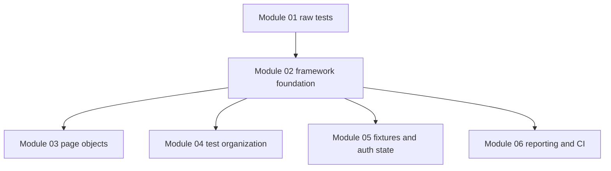
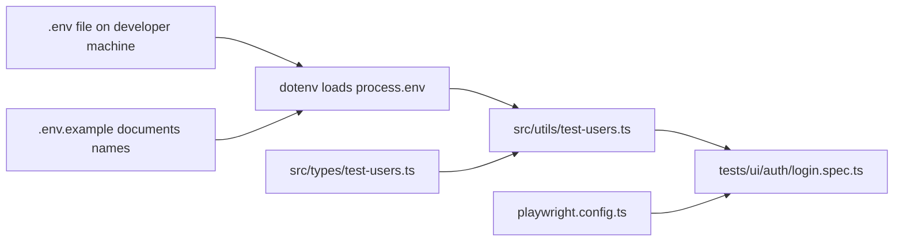

# Module 02: Framework Foundation

## What This Module Adds

Module 01 proved that Playwright can run tests. Module 02 turns that starter project into the first real framework foundation.

The goal is not to add many tests. The goal is to make the existing tests easier to configure, repeat, and maintain.

Module 02 adds:

- richer `playwright.config.ts` settings
- environment variable support through `dotenv`
- `.env.example` as a safe template
- typed SauceDemo users under `src/types/` and `src/utils/`
- npm scripts for common execution modes
- project structure conventions that later modules build on

## Why Foundation Work Matters

Without a foundation, tests become scattered scripts. A framework needs a predictable place for:

- configuration
- test data
- page objects
- fixtures
- reports
- API helpers
- CI workflows



Module 02 is the layer that keeps later modules from becoming ad hoc.

## Files Added Or Changed

| File | Status In Module 02 | Learning Purpose |
|---|---|---|
| `playwright.config.ts` | changed | Centralizes browser projects, timeouts, reports, artifacts, and `baseURL` |
| `package.json` | changed | Adds scripts for headed/debug/UI/browser-specific runs |
| `package-lock.json` | changed | Locks new dependency versions |
| `.env.example` | added | Documents supported environment variables without committing secrets |
| `.gitignore` | changed | Ignores generated reports, auth state, env files, and dependency folders |
| `src/types/test-users.ts` | added | Defines typed SauceDemo user shapes |
| `src/utils/test-users.ts` | added | Reads users from environment variables with safe fallbacks |
| `tests/learning/first-run.spec.ts` | changed | Uses reusable test user data |
| `tests/ui/auth/login.spec.ts` | changed | Uses reusable test user data |

## Core Design Decision

Module 02 introduces shared data, but not page objects.

That is deliberate:

- shared data reduces duplication without hiding Playwright
- page objects are a larger abstraction and belong in Module 03

The login test still shows raw locators and actions, but credentials now come from one trusted source:

```ts
SauceDemoUsers.standard.username
SauceDemoUsers.standard.password
```

This is the bridge between direct beginner tests and framework-style reuse.

## Concept Map



## What Is Still Deferred

Module 02 does not add:

- page object classes
- data-driven loops
- API tests
- fixtures
- saved authentication
- CI workflows

Those are future modules. A clean curriculum depends on adding each abstraction only when the learner has a reason to want it.

## Quality Gate

Module 02 is complete when:

- `npm run typecheck` passes
- `npm test` passes
- config supports Chromium, Firefox, WebKit, and mobile project definitions
- environment variables are documented in `.env.example`
- user credentials are centralized in typed helpers
- docs explain every file introduced or changed by the module
