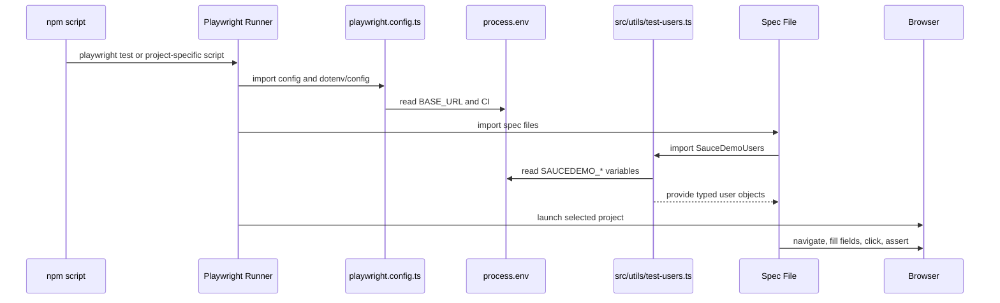

# Module 02 Framework Lifecycle Deep Dive

## Mental Model

Module 02 turns the starter project into a configurable testing foundation.

In Module 01 the spec knew nearly everything: where to go, which user to type, and how to run. In Module 02, those responsibilities begin moving to stable framework locations:

- [playwright.config.ts](../../playwright.config.ts) owns runner configuration.
- [.env.example](../../.env.example) documents the environment variables a developer may provide locally.
- [src/types/test-users.ts](../../src/types/test-users.ts) defines the shape of SauceDemo user data.
- [src/utils/test-users.ts](../../src/utils/test-users.ts) builds reusable user objects from environment variables and safe defaults.
- [tests/learning/first-run.spec.ts](../../tests/learning/first-run.spec.ts) and [tests/ui/auth/login.spec.ts](../../tests/ui/auth/login.spec.ts) consume shared users while still showing raw Playwright actions.

The framework is still deliberately simple. Module 02 centralizes configuration and data, but it does not add page objects. That keeps the learner focused on one new layer: how tests become repeatable across machines and browsers.

## Execution Flow

The Module 02 runtime flow has one extra step before the browser starts: configuration and environment loading.



The key detail is that imports execute before the test body runs. When a spec imports `SauceDemoUsers`, [src/utils/test-users.ts](../../src/utils/test-users.ts) builds the user object immediately from `process.env` and fallback values.

## Code Walkthrough

Start with [playwright.config.ts](../../playwright.config.ts). It imports `dotenv/config`, then reads:

```ts
const baseURL = process.env.BASE_URL ?? 'https://www.saucedemo.com';
```

The `??` operator means "use the right-side value only when the left side is `null` or `undefined`." If a developer creates a local `.env` with `BASE_URL`, that value wins. Otherwise, SauceDemo remains the default.

The `projects` array now defines Chromium, Firefox, WebKit, and Mobile Chrome. The tests do not need to know which browser is running. Playwright repeats the same spec under each selected project.

Next read [.env.example](../../.env.example). This file is documentation, not a secret file. It teaches the supported variable names and safe public demo defaults. A real `.env` file should stay local because environment files often contain credentials in professional projects.

The type file [src/types/test-users.ts](../../src/types/test-users.ts) defines two important contracts:

- `SauceDemoUserRole` limits role names to known string values such as `'standard'` and `'locked'`.
- `TestUser` requires every user object to have `username`, `password`, and `role`.

The utility file [src/utils/test-users.ts](../../src/utils/test-users.ts) then implements the contract:

```ts
function buildSauceDemoUser(
  role: SauceDemoUserRole,
  envKey: string,
  fallbackUsername: string,
): TestUser
```

That helper has one job: build one complete user from a role, the environment variable name, and a fallback username. The exported `SauceDemoUsers` object calls that helper for every supported SauceDemo account.

Finally inspect [tests/ui/auth/login.spec.ts](../../tests/ui/auth/login.spec.ts). The locator and assertion flow is still visible, but credentials now come from:

```ts
SauceDemoUsers.standard.username
SauceDemoUsers.standard.password
```

That one change removes repeated hard-coded credentials from specs without hiding browser behavior behind a page object.

## TypeScript And Framework Syntax To Notice

`import 'dotenv/config';` is a side-effect import. It imports a module because that module changes runtime behavior by loading `.env` values into `process.env`.

`import type { SauceDemoUserRole, TestUser } ...` imports TypeScript types only. These imports help the compiler but do not become runtime JavaScript logic.

`process.env.BASE_URL ?? 'https://www.saucedemo.com'` is fallback configuration. It lets local and CI environments override values without changing source code.

`readonly username: string` in the `TestUser` interface communicates that test code should read user data, not mutate it.

`as const satisfies Record<SauceDemoUserRole, TestUser>` is a strong TypeScript pattern. It keeps the object literal's specific keys while also proving that every role maps to a valid `TestUser`.

If you are coming from Java:

- `interface TestUser` is similar to a small data contract.
- `Record<SauceDemoUserRole, TestUser>` is similar to a typed map from role to user.
- `process.env` is comparable to reading system environment variables.
- `readonly` expresses immutability intent for object properties.

## Responsibility Boundaries

Configuration belongs in [playwright.config.ts](../../playwright.config.ts). Specs should not decide retry counts, browser projects, reporter output, or global base URL.

Environment variable names belong in [.env.example](../../.env.example) and the utilities that read them. Specs should consume meaningful objects such as `SauceDemoUsers.standard`, not raw strings such as `process.env.SAUCEDEMO_STANDARD_USER`.

Types belong in [src/types/](../../src/types/test-users.ts). They explain the shape of shared data.

Construction logic belongs in [src/utils/](../../src/utils/test-users.ts). It turns raw environment values into reusable framework data.

Spec files remain responsible for behavior under test: what the user does and what the browser should show afterward.

## Common Mistakes

Do not commit a real `.env` file. Commit [.env.example](../../.env.example) so teammates know what to create locally.

Do not read `process.env` directly throughout every spec. That spreads configuration rules across the suite and makes later changes harder.

Do not introduce page objects in Module 02. The framework foundation should improve configuration and data reuse first.

Do not assume every browser behaves exactly like Chromium. Module 02 adds multiple browser projects so browser-specific issues can surface early.

Do not remove visible assertions when centralizing data. Shared credentials make setup cleaner, but the test still needs user-visible proof that login worked or failed.

## Debugging And Failure Model

If every test fails before navigation, inspect [playwright.config.ts](../../playwright.config.ts) and the `BASE_URL` value.

If login starts failing across multiple specs, inspect [src/utils/test-users.ts](../../src/utils/test-users.ts) and the relevant `SAUCEDEMO_*` environment variables.

If TypeScript fails, read the type error carefully. A mismatch in `SauceDemoUserRole` or `TestUser` is usually a useful signal that the shared data shape changed.

If only one browser project fails, rerun that project directly:

```bash
npm run test:webkit -- tests/ui/auth/login.spec.ts
```

If a mobile project fails, check whether the same locator is visible and usable at the mobile viewport.

## Interview Readiness

A strong Module 02 explanation is:

"I separated configuration and reusable data from test behavior. The Playwright config owns runner concerns such as projects, timeouts, reporters, artifacts, and base URL. The user utility owns credentials and environment fallback logic. The specs still show the raw browser actions because page objects are introduced only after the foundation is stable."

Be ready to explain why [.env.example](../../.env.example) is committed but `.env` is ignored. The example file documents the contract; the real file may contain machine-specific or sensitive values.

Also be ready to explain why TypeScript is valuable here. It prevents accidental role names or malformed user objects before the tests even launch a browser.

## Revision Checklist

Before moving beyond Module 02, confirm you can answer:

- Which file decides the browser projects?
- Why can specs still call `page.goto('/')`?
- Where are SauceDemo usernames defined?
- What happens if `SAUCEDEMO_STANDARD_USER` is not set?
- Why does the framework use `import type`?
- What does `as const satisfies Record<SauceDemoUserRole, TestUser>` protect?
- Why are page objects still deferred to Module 03?
