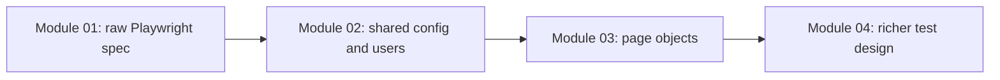
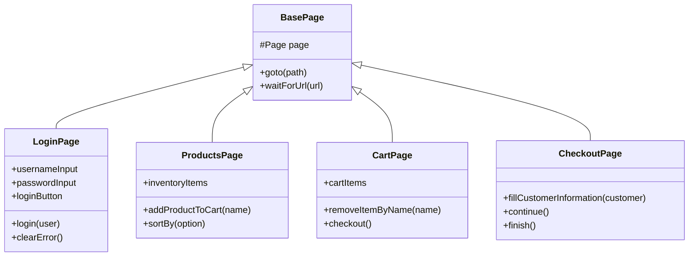

# Module 03: Page Object Model

## What This Module Adds

Module 03 introduces the Page Object Model, the first major test-framework abstraction in this repo.

Module 01 showed raw Playwright calls. Module 02 centralized configuration and test users. Module 03 moves repeated page-specific locators and user actions into classes.



## Why Page Objects Exist

Without page objects, tests repeat UI details:

```ts
await page.getByPlaceholder('Username').fill(SauceDemoUsers.standard.username);
await page.getByPlaceholder('Password').fill(SauceDemoUsers.standard.password);
await page.getByRole('button', { name: 'Login' }).click();
```

That is good for learning the raw API, but repetition grows quickly. If the username selector changes, every spec that logs in must be edited.

With a page object:

```ts
await loginPage.login(SauceDemoUsers.standard);
```

The test communicates intent, and the page object owns the UI mechanics.

## Files Added Or Changed

| File | Status | Purpose |
|---|---|---|
| `src/page-objects/BasePage.ts` | added | Shared base class for page objects that need the same `page` storage and navigation helpers |
| `src/page-objects/LoginPage.ts` | added | Encapsulates SauceDemo login screen locators and actions |
| `src/page-objects/ProductsPage.ts` | added | Encapsulates product list, sort, cart badge, and product-card actions |
| `src/page-objects/CartPage.ts` | added | Encapsulates cart item lookup and checkout/continue actions |
| `src/page-objects/CheckoutPage.ts` | added | Encapsulates checkout form, validation error, and completion actions |
| `src/types/products.ts` | added | Provides product-name and sort-option types |
| `src/types/checkout.ts` | added | Provides checkout customer data type |
| `tests/ui/auth/login.spec.ts` | changed | Rewritten to use `LoginPage` and `ProductsPage` |
| `tests/ui/products/products.spec.ts` | added | Demonstrates product page object behavior |
| `tests/ui/cart/cart.spec.ts` | added | Demonstrates cart page object behavior |
| `tests/ui/checkout/checkout.spec.ts` | added | Demonstrates checkout page object behavior |

Module 03 also reuses Module 02 files:

- `src/utils/test-users.ts`
- `src/types/test-users.ts`
- `playwright.config.ts`

## Page Object Responsibility

A page object should know:

- how to find elements on that page
- how to perform common user actions on that page
- how to expose meaningful page state for assertions

A page object should not know:

- the test case title
- whether a behavior is business-critical
- how many browsers are configured
- whether a test belongs to smoke or regression

That separation keeps test intent in specs and UI mechanics in page classes.

## Module 03 Dependency Map



## What Is Still Deferred

Module 03 does not add:

- test data arrays and generated test cases
- API testing
- custom fixtures
- saved authentication state
- reporting and CI

Those are future modules. Module 03 focuses on the page abstraction only.

## Quality Gate

Module 03 is complete when:

- all page objects compile
- POM-based specs pass
- docs explain locator strategy, including why XPath is not the default
- docs explain the Base Page pattern
- exercises extend implemented behavior instead of asking the learner to recreate already completed work
