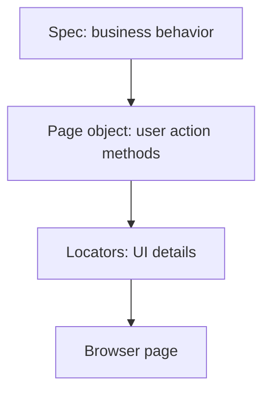

# Page Object Model

## The Problem POM Solves

UI tests have two kinds of knowledge:

1. test intent: "a standard user can log in"
2. UI mechanics: "the username input is found by placeholder and the login button is found by role"

When both kinds of knowledge live in every spec, tests become noisy and expensive to maintain.

Page Object Model separates them:



The spec should read like behavior. The page object should contain the details of how the page is operated.

## Before POM

```ts
await page.getByPlaceholder('Username').fill(SauceDemoUsers.standard.username);
await page.getByPlaceholder('Password').fill(SauceDemoUsers.standard.password);
await page.getByRole('button', { name: 'Login' }).click();
await expect(page.getByText('Products')).toBeVisible();
```

This is clear for Module 01, but every login test would repeat it.

## After POM

```ts
const loginPage = new LoginPage(page);
const productsPage = new ProductsPage(page);

await loginPage.goto();
await loginPage.login(SauceDemoUsers.standard);

await expect(productsPage.title).toHaveText('Products');
```

Now the spec says what behavior matters. `LoginPage` owns how login works.

## Anatomy Of A Page Object

```ts
export class LoginPage extends BasePage {
  readonly usernameInput: Locator;
  readonly passwordInput: Locator;
  readonly loginButton: Locator;

  constructor(page: Page) {
    super(page);
    this.usernameInput = page.getByPlaceholder('Username');
    this.passwordInput = page.getByPlaceholder('Password');
    this.loginButton = page.getByRole('button', { name: 'Login' });
  }

  async login(user: TestUser): Promise<void> {
    await this.loginWithCredentials(user.username, user.password);
  }
}
```

Important parts:

- `readonly` locators are assigned once in the constructor
- `constructor(page: Page)` receives the Playwright page fixture
- `super(page)` initializes the base class
- methods such as `login` represent user actions

## Public Locators vs Methods

This repo exposes some locators publicly:

```ts
await expect(loginPage.errorMessage).toContainText('Epic sadface');
```

That is acceptable when the locator represents a page state the test should assert.

This repo also exposes methods:

```ts
await loginPage.login(SauceDemoUsers.standard);
```

Use a method when the test wants to perform a meaningful user action. Use a locator when the test wants to assert visible page state.

## The Base Page Pattern

`BasePage` stores behavior common to all page objects.

```ts
export abstract class BasePage {
  protected constructor(protected readonly page: Page) {}

  async goto(path: string): Promise<void> {
    await this.page.goto(path);
  }

  async waitForUrl(url: string | RegExp): Promise<void> {
    await this.page.waitForURL(url);
  }
}
```

Why it exists:

- every page object needs access to the Playwright `page`
- common navigation helpers should not be repeated
- future shared behavior has a natural home

Why it stays small:

- a large base class becomes a dumping ground
- not every helper belongs on every page
- page-specific behavior should remain in the page-specific class

Module 03 includes `BasePage` because the source material explicitly introduces the pattern, and it is a useful teaching moment. The implementation is intentionally minimal.

## Good Page Object Method Names

Good names describe user intent:

```ts
await productsPage.addProductToCart('Sauce Labs Backpack');
await cartPage.checkout();
await checkoutPage.fillCustomerInformation(customer);
```

Weak names leak implementation:

```ts
await productsPage.clickButton1();
await cartPage.findThing();
await checkoutPage.doStuff();
```

When a method name sounds like the user's action, specs become readable.

## Key Takeaways

- POM separates test intent from UI mechanics.
- Page objects own locators and common page actions.
- Specs still own assertions and behavior meaning.
- `BasePage` is useful when kept small and focused.
- Do not add abstractions before they reduce real duplication or clarify behavior.
