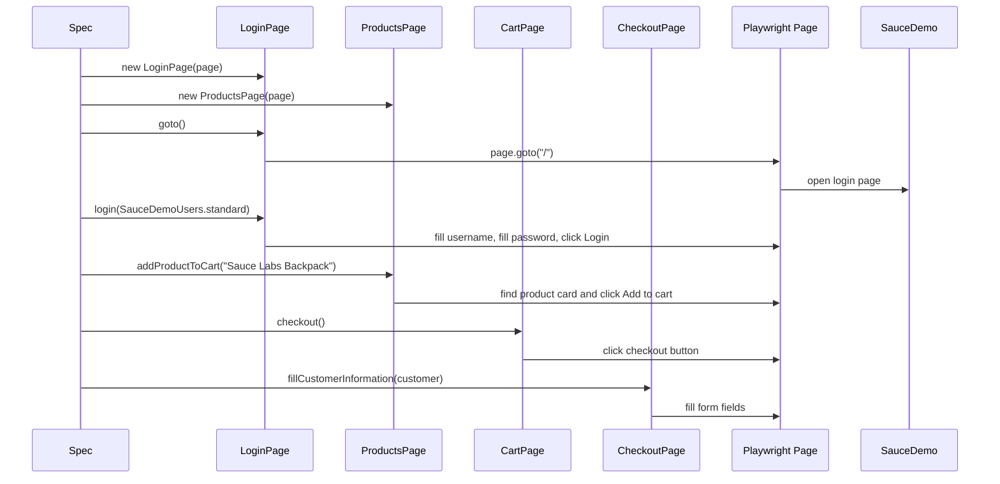

# Module 03 Framework Lifecycle Deep Dive

## Mental Model

Module 03 introduces the first real framework abstraction: page objects.

The mental shift is from "a spec knows every selector" to "a spec describes a user scenario, while a page object knows how that page works." The browser still does the same actions as Module 01 and Module 02. The difference is where the UI mechanics live.

At this checkpoint:

- [LoginPage](../../src/page-objects/LoginPage.ts) owns login page locators and login actions.
- [ProductsPage](../../src/page-objects/ProductsPage.ts) owns inventory page product, cart badge, and sort behavior.
- [CartPage](../../src/page-objects/CartPage.ts) owns cart item lookup, removal, and checkout navigation.
- [CheckoutPage](../../src/page-objects/CheckoutPage.ts) owns checkout form fields and checkout completion actions.
- [BasePage](../../src/page-objects/BasePage.ts) stores the shared Playwright `page` and reusable navigation helpers.

Think of a page object as a remote control for one screen. A test should press meaningful buttons on the remote. The remote can know the wiring details.

## Execution Flow

The Module 03 flow adds object construction before user actions:



The page objects do not create a browser. Playwright still creates the `page` fixture. Each page object receives that same `page` so actions happen in the same browser tab.

## Code Walkthrough

Start with [BasePage](../../src/page-objects/BasePage.ts):

```ts
export abstract class BasePage {
  protected constructor(protected readonly page: Page) {}
}
```

`abstract` means this class is a shared parent, not a page object you create directly. The constructor stores the Playwright `Page` so child classes can navigate and interact with the browser.

[LoginPage](../../src/page-objects/LoginPage.ts) shows the basic pattern. The constructor defines locators once:

```ts
this.usernameInput = page.getByPlaceholder('Username');
this.loginButton = page.getByRole('button', { name: 'Login' });
```

The methods then describe user actions:

- `goto()` opens the login route.
- `login(user)` logs in with a typed `TestUser`.
- `loginWithCredentials(username, password)` supports negative credential tests.
- `clearError()` closes the error banner.

[ProductsPage](../../src/page-objects/ProductsPage.ts) is more interesting because it handles repeated product cards. The private method `productCard(productName)` scopes work to one product:

```ts
return this.inventoryItems.filter({ hasText: productName });
```

That lets methods like `addProductToCart` and `getProductPrice` avoid duplicating the card-selection logic.

[CartPage](../../src/page-objects/CartPage.ts) uses the same idea with `cartItem(productName)`. Tests can ask for a product's price or details without knowing the CSS structure inside the cart row.

[CheckoutPage](../../src/page-objects/CheckoutPage.ts) wraps form interactions and completion checks. The test passes a typed [CheckoutCustomer](../../src/types/checkout.ts), and the page object fills the relevant fields.

The specs now read closer to workflows:

- [login.spec.ts](../../tests/ui/auth/login.spec.ts) uses `LoginPage` for login behavior and `ProductsPage` for the post-login title.
- [products.spec.ts](../../tests/ui/products/products.spec.ts) verifies catalog, badge, sorting, and product price behavior.
- [cart.spec.ts](../../tests/ui/cart/cart.spec.ts) proves inventory-to-cart behavior.
- [checkout.spec.ts](../../tests/ui/checkout/checkout.spec.ts) proves checkout completion and validation.

## TypeScript And Framework Syntax To Notice

`protected readonly page: Page` means child page classes can use the Playwright page, but outside test code should not mutate that property directly.

`extends BasePage` means each page object inherits shared navigation helpers.

`Promise<void>`, `Promise<number>`, and `Promise<string[]>` make asynchronous return values explicit. Browser calls do not return final values immediately.

`private productCard(...)` hides an internal helper from specs. The test should call `addProductToCart`, not manipulate product-card locators directly.

`Locator` is Playwright's lazy element handle. A locator describes how to find an element when an action or assertion runs. It is not the same as immediately grabbing a DOM node.

`enum ProductSortOption` in [src/types/products.ts](../../src/types/products.ts) gives readable names for SauceDemo sort values such as `lohi`.

If you are coming from Java:

- A page object class is similar to a page-specific service object with methods such as `login` or `checkout`.
- `private` and `protected` have the same design purpose: keep implementation details behind a clear public API.
- `Promise<T>` is the async equivalent of "this method will eventually produce a `T`."
- Type-only imports are like compile-time-only references.

## Responsibility Boundaries

Specs own test intent. For example, [checkout.spec.ts](../../tests/ui/checkout/checkout.spec.ts) decides that checkout should finish successfully for one product.

Page objects own UI mechanics. [CheckoutPage](../../src/page-objects/CheckoutPage.ts) knows which selectors map to first name, last name, postal code, continue, and finish.

Types own shared vocabulary. [SauceDemoProductName](../../src/types/products.ts) prevents accidental product names that SauceDemo does not support.

Utilities still own reusable data. [SauceDemoUsers](../../src/utils/test-users.ts) remains the source for login users.

Base classes should stay small. [BasePage](../../src/page-objects/BasePage.ts) only contains behavior that truly applies across pages. If every helper goes into the base class, it becomes a dumping ground.

## Common Mistakes

Do not put assertions for every scenario inside page objects. Assertions can exist in page objects when they express reusable page state, but Module 03 keeps most assertions in specs so test intent remains visible.

Do not expose every locator just because it is convenient. Public locators are acceptable in this learning checkpoint, but page objects should still provide meaningful methods for common actions.

Do not create one massive `SauceDemoPage`. Separate page objects keep responsibilities clear.

Do not instantiate page objects before Playwright provides the `page` fixture. Page objects need the live browser tab.

Do not make product names plain arbitrary strings when the valid list is known. Use the product-name type to catch mistakes earlier.

## Debugging And Failure Model

If a POM-based test fails, identify which layer failed:

- Did the spec create the correct page object with the current `page`?
- Did the page object method navigate or click the expected UI?
- Did a locator stop matching the page?
- Did the app state not reach the assertion?

When a locator fails, open the relevant page object first. The selector is probably centralized there.

When a workflow fails after login, confirm the previous page object action actually changed browser state. For example, if `productsPage.addProductToCart(...)` fails, check both the product-card helper and whether the login step reached inventory.

Run a focused spec while debugging:

```bash
npm run test:chromium -- tests/ui/products/products.spec.ts
```

## Interview Readiness

A strong Module 03 explanation is:

"I introduced page objects only after the raw Playwright flow and shared data were clear. Each page object wraps locators and common user actions for one SauceDemo screen. Specs keep business intent and assertions, while page objects hide selector details. This makes future UI selector changes localized without turning specs into unreadable helper chains."

Be ready to explain why `LoginPage.login(user)` and `LoginPage.loginWithCredentials(username, password)` both exist. The first supports normal typed users. The second keeps negative login testing flexible.

Be ready to explain why `productCard` and `cartItem` are private helpers. They prevent duplicated filtering logic while keeping specs focused on behavior.

## Revision Checklist

Before moving beyond Module 03, confirm you can answer:

- What problem does the Page Object Model solve?
- Why does each page object receive the same Playwright `page` fixture?
- What belongs in a page object, and what belongs in a spec?
- Why is `BasePage` abstract?
- How does `ProductsPage` find one product card?
- Why are product names and checkout customer data typed?
- What would you update if SauceDemo changed the login button selector?
