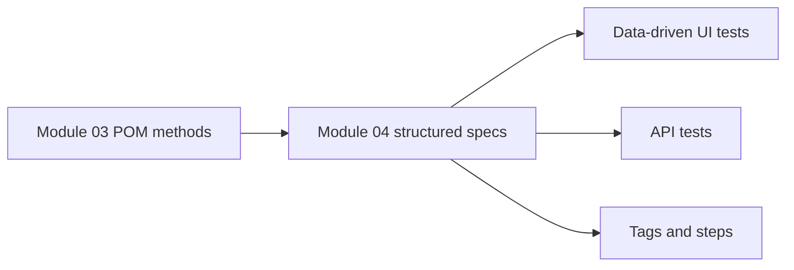

# Module 04: Writing Tests

## What This Module Adds

Module 04 is about test design. The framework already has configuration, typed data, and page objects. Now the focus shifts to writing tests that are clear, organized, and expressive.

This module adds:

- AAA structure in specs
- stronger use of `test.describe` and `beforeEach`
- `test.step` for readable reports
- smoke tags such as `@smoke`
- data-driven UI tests
- JSON test data under `test-data/`
- first Playwright API tests using the `request` fixture
- an `api` project in `playwright.config.ts`

## Learning Progression

## Files Added Or Changed

| File | Status | Purpose |
|---|---|---|
| `playwright.config.ts` | changed | Adds an `api` project and prevents browser projects from running API specs |
| `package.json` | changed | Adds `test:api` and `test:smoke` scripts |
| `tests/ui/auth/login.spec.ts` | changed | Adds smoke tagging and `test.step` structure |
| `tests/ui/auth/login-data-driven.spec.ts` | added | Demonstrates data-driven login testing |
| `tests/ui/products/products.spec.ts` | changed | Adds clearer AAA/test step organization |
| `tests/ui/products/products-data.spec.ts` | added | Demonstrates JSON-backed product tests |
| `tests/api/jsonplaceholder.spec.ts` | added | Introduces Playwright API testing with `request` |
| `test-data/saucedemo-products.json` | added | External product data for data-driven tests |

## Why API Testing Appears In A UI Course

Modern SDETs often test through multiple layers:

- UI tests verify real user workflows
- API tests verify service behavior faster
- combined strategies catch mismatches between frontend and backend expectations

Module 04 introduces API testing lightly. It does not create a full API framework yet. The purpose is to learn Playwright's `request` fixture and compare UI vs API test styles.

## What Is Still Deferred

Module 04 does not add:

- custom fixtures
- saved authentication state
- file upload/download tests
- network mocking
- CI/reporting expansion

Those arrive later. Module 04 is still about writing better tests on top of the existing framework.

## Quality Gate

Module 04 is complete when:

- TypeScript passes
- UI tests pass
- API tests pass
- smoke script selects only tagged tests
- docs reference the actual Module 04 specs and data files
- exercises extend the implemented examples instead of duplicating existing tests
