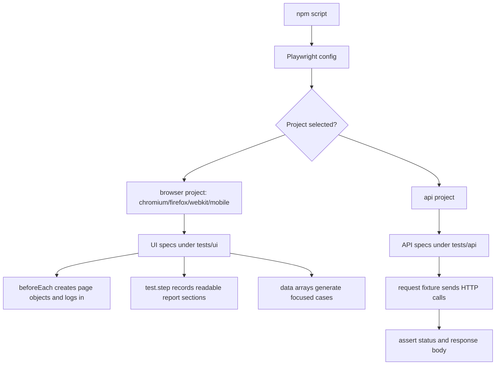

# Module 04 Framework Lifecycle Deep Dive

## Mental Model

Module 04 is where the framework starts behaving like a test suite instead of a collection of examples.

Modules 01-03 answered "Can we automate the browser, configure it, and hide page details behind page objects?" Module 04 answers "Can we write tests that are organized, readable in reports, reusable across data sets, and not limited to the UI layer?"

At this checkpoint the framework adds:

- structured UI specs with `test.describe`, `beforeEach`, and `test.step`
- smoke tagging with `@smoke`
- data-driven login cases in [login-data-driven.spec.ts](../../tests/ui/auth/login-data-driven.spec.ts)
- JSON-backed product cases from [saucedemo-products.json](../../test-data/saucedemo-products.json)
- first API coverage through [jsonplaceholder.spec.ts](../../tests/api/jsonplaceholder.spec.ts)
- an `api` project in [playwright.config.ts](../../playwright.config.ts)

The main lesson is test design. Page objects make actions reusable; Module 04 makes the tests themselves easier to scan, report, and extend.

## Execution Flow

The Module 04 flow splits into UI and API paths.



The config uses `testIgnore` so browser projects skip [tests/api/](../../tests/api). The `api` project uses `testMatch` so it runs only API specs.

## Code Walkthrough

Start with [playwright.config.ts](../../playwright.config.ts). The important Module 04 addition is:

```ts
const browserProjectIgnore = [/tests\/api\//];
```

Each browser project uses that ignore rule. The separate `api` project uses:

```ts
testMatch: /tests\/api\/.*\.spec\.ts/
```

That keeps API tests out of browser runs and keeps browser setup out of API-only runs.

Next inspect [tests/ui/auth/login.spec.ts](../../tests/ui/auth/login.spec.ts). The smoke login test is written with report steps:

```ts
await test.step('Act: log in as the standard user', async () => {
  await loginPage.login(SauceDemoUsers.standard);
});
```

The step label is not a comment. It becomes visible in Playwright reports and traces, which helps when diagnosing failures.

[tests/ui/auth/login-data-driven.spec.ts](../../tests/ui/auth/login-data-driven.spec.ts) introduces a data array:

```ts
const invalidLoginCases = [
  { title: 'missing username', ... },
  { title: 'missing password', ... },
  { title: 'locked user', ... },
];
```

The `for...of` loop creates one Playwright test per case. This is better than one giant test because each case gets its own title, result, retry behavior, and report entry.

[tests/ui/products/products-data.spec.ts](../../tests/ui/products/products-data.spec.ts) reads JSON product data:

```ts
import products from '../../../test-data/saucedemo-products.json';
const productCases = products as ProductCase[];
```

The `ProductCase` type documents the expected data shape, while the JSON file keeps the data easy to edit.

[tests/api/jsonplaceholder.spec.ts](../../tests/api/jsonplaceholder.spec.ts) uses Playwright's `request` fixture instead of `page`. There is no browser tab in these tests. The API spec sends HTTP requests, checks status codes, parses JSON, and verifies response shape.

## TypeScript And Framework Syntax To Notice

`test.beforeEach(async ({ page }) => { ... })` runs setup before every test in the `describe` block. In UI specs, it commonly creates page objects and navigates to a known starting state.

`test.step(name, async () => { ... })` groups actions or assertions in the report. It should describe a meaningful phase, not every tiny line.

`for (const loginCase of invalidLoginCases) { test(...) }` generates tests at declaration time. The loop runs while the spec file is loaded, and Playwright registers each generated test.

`type ProductCase = { ... }` creates a local type for JSON-backed data. It helps the reader understand what fields a product case must include.

`const productCases = products as ProductCase[]` is a type assertion. It tells TypeScript how to treat imported JSON. In a larger framework, runtime schema validation may be added later, but Module 04 keeps the focus on data-driven tests.

`await request.get(...)` uses Playwright's API testing fixture. It returns an API response object, not a browser page.

If you are coming from Java:

- `beforeEach` maps closely to setup methods in JUnit or TestNG.
- Data-driven `for...of` tests are similar in goal to parameterized tests or data providers.
- `interface JsonPlaceholderPost` is a response DTO shape for compile-time checking.
- `request.get` and `request.post` are comparable to using an HTTP client in API tests.

## Responsibility Boundaries

Page objects still own UI mechanics. Module 04 does not move selectors back into specs.

Specs now own structure. They decide setup hooks, steps, tags, and scenario names.

Test data files own stable example data. [saucedemo-products.json](../../test-data/saucedemo-products.json) should contain data, not test logic.

API specs own HTTP-level checks. [jsonplaceholder.spec.ts](../../tests/api/jsonplaceholder.spec.ts) should not instantiate page objects because it does not use the browser.

The config owns test routing. [playwright.config.ts](../../playwright.config.ts) decides which project runs which spec category.

## Common Mistakes

Do not put many unrelated assertions into one data-driven test. Separate generated tests make failures easier to understand.

Do not use `test.step` as decoration around every single line. Steps are useful when they mark Arrange, Act, Assert, or a business phase.

Do not let browser projects run API specs. That wastes time and can produce confusing report output.

Do not hide bad test data behind broad `as` assertions. The assertion is acceptable here for a learning checkpoint, but the data still needs to match the declared shape.

Do not overuse `@smoke`. A smoke tag should identify a small, high-signal subset, not every test you like.

## Debugging And Failure Model

If a data-driven test fails, read the generated test title first. The title tells you which case failed.

If every generated product test fails, inspect the shared `beforeEach` login setup and the imported JSON path.

If one product case fails, inspect [saucedemo-products.json](../../test-data/saucedemo-products.json) and the corresponding page-object method.

If an API test fails, check status first, then response body. A network, service, or contract issue should be debugged differently from a UI locator failure.

Useful focused commands:

```bash
npm run test:smoke
npm run test:api
npm run test:chromium -- tests/ui/auth/login-data-driven.spec.ts
```

## Interview Readiness

A strong Module 04 explanation is:

"After introducing page objects, I improved test design. I used hooks for repeated setup, `test.step` for report readability, tags for smoke selection, data-driven tests for repeated validation patterns, and a separate Playwright API project for HTTP checks. The config routes browser and API specs differently so each layer runs with the right fixture model."

Be ready to explain why a loop creates separate tests instead of one test with several assertions. Separate tests isolate failures and make reports clearer.

Be ready to explain why UI and API tests both belong in an SDET framework. They answer different questions: UI tests validate user workflows; API tests validate service behavior faster and closer to the contract.

## Revision Checklist

Before moving beyond Module 04, confirm you can answer:

- What does AAA mean in a Playwright spec?
- What does `beforeEach` set up in the UI specs?
- Why does `test.step` improve debugging?
- How does the smoke script select tests?
- How are invalid login cases generated?
- Why is product data stored under `test-data/`?
- What is the difference between the `page` fixture and the `request` fixture?
- How does the config prevent browser projects from running API specs?
