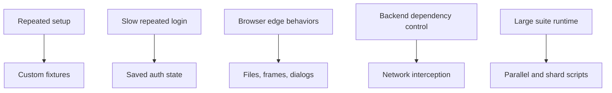

# Module 05: Advanced Features

## What This Module Adds

Module 05 teaches Playwright features that solve advanced test-suite problems:

- reducing repeated setup with custom fixtures
- reusing authentication state
- testing file uploads and downloads
- interacting with iframes
- handling browser dialogs
- intercepting and observing network traffic
- controlling execution with projects, workers, and sharding scripts

These are not random tricks. Each feature answers a specific framework need.

## Files Added Or Changed

| File | Status | Purpose |
|---|---|---|
| `src/fixtures/saucedemo-fixtures.ts` | added | Custom fixtures for login page, logged-in products page, and pre-filled cart |
| `tests/ui/products/products-fixtures.spec.ts` | added | Demonstrates fixture-provided logged-in product state |
| `tests/ui/cart/cart-fixtures.spec.ts` | added | Demonstrates fixture-provided cart state |
| `tests/setup/auth.setup.ts` | added | Logs in once and saves storage state |
| `tests/ui/authenticated/authenticated-products.spec.ts` | added | Uses saved auth state without UI login |
| `tests/advanced/file-handling.spec.ts` | added | Upload, in-memory upload, and download examples |
| `tests/advanced/iframes-dialogs.spec.ts` | added | Frame locator and dialog handling examples |
| `tests/advanced/network-interception.spec.ts` | added | Mock, block, and observe network requests |
| `test-data/upload-sample.txt` | added | File upload fixture data |
| `playwright.config.ts` | changed | Adds advanced/auth projects and excludes advanced tests from browser smoke runs |
| `package.json` | changed | Adds advanced/auth/parallel/shard scripts |

## Why These Features Are Advanced

The earlier modules mostly test ordinary page flows. Module 05 tests conditions that require deeper Playwright control:

- the test runner creates custom dependencies for each test
- browser context storage is saved and reused
- local files are passed through browser file inputs
- dialogs are handled before they block the page
- routes intercept requests before the browser completes them

Advanced means the test controls more of the browser environment.

## Quality Gate

Module 05 is complete when:

- `npm run typecheck` passes
- `npm run test:advanced` passes
- `npm run test:authenticated` passes and generates ignored auth state
- fixture-based UI tests pass through normal `npm test`
- docs explain the actual advanced files introduced in this module
