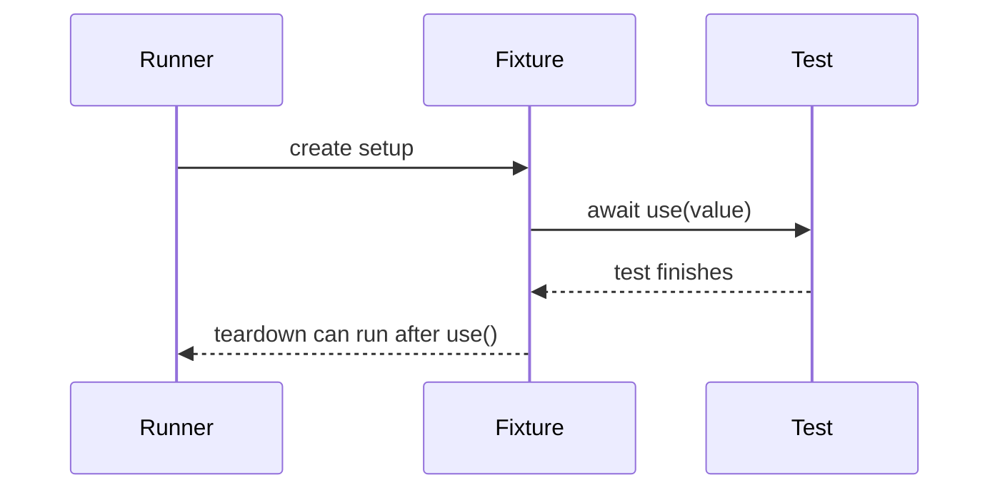

# Fixtures And Authentication State

## Why Fixtures Exist

By Module 04, many specs create the same objects and repeat the same login setup:

```ts
const loginPage = new LoginPage(page);
const productsPage = new ProductsPage(page);

await loginPage.goto();
await loginPage.login(SauceDemoUsers.standard);
```

Custom fixtures let the framework define that setup once and inject the result into tests.

## Playwright Fixture Lifecycle



The key line is `await use(value)`. Code before it is setup. Code after it is teardown.

## Module 05 Fixture File

`src/fixtures/saucedemo-fixtures.ts` extends Playwright's base test:

```ts
export const test = base.extend<SauceDemoFixtures>({
  productsPage: async ({ page }, use) => {
    const loginPage = new LoginPage(page);
    const productsPage = new ProductsPage(page);

    await loginPage.goto();
    await loginPage.login(SauceDemoUsers.standard);
    await use(productsPage);
  },
});
```

This creates a `productsPage` fixture that is already logged in.

Tests import from the fixture file instead of `@playwright/test`:

```ts
import { expect, test } from '../../../src/fixtures/saucedemo-fixtures';
```

That import is the switch that makes custom fixtures available.

## Fixture Scope In This Module

Module 05 uses test-scoped fixtures. Each test gets fresh setup.

That is safer for beginners because tests do not share state.

Future optimization may introduce worker-scoped fixtures, but only when the suite has a real performance reason and state sharing is controlled.

## Saved Authentication State

Fixtures reduce setup code, but they still perform UI login before each test. Saved auth state solves a different problem: avoid repeated login when the test does not care about login behavior.

`tests/setup/auth.setup.ts` logs in once:

```ts
await loginPage.goto();
await loginPage.login(SauceDemoUsers.standard);
await page.waitForURL(/inventory/);
await page.context().storageState({ path: standardUserAuthFile });
```

The storage state file is written under:

```text
playwright/.auth/standard-user.json
```

That file is ignored because it may contain session cookies in real projects.

## Auth Project Dependencies

`playwright.config.ts` adds:

```ts
{
  name: 'auth-setup',
  testMatch: /tests\/setup\/.*\.setup\.ts/,
}
```

and:

```ts
{
  name: 'authenticated-chromium',
  testMatch: /tests\/ui\/authenticated\/.*\.spec\.ts/,
  dependencies: ['auth-setup'],
  use: {
    storageState: standardUserAuthFile,
  },
}
```

The dependency means Playwright runs the setup project before the authenticated tests.

## Fixture Login vs Saved Auth

Use fixture login when:

- the test needs to prove login still works
- setup is small and readable
- each test should start from a fresh UI-authenticated path

Use saved auth when:

- the test is not about login
- repeated login makes the suite slow
- the app supports stable session reuse

## Code References

Read:

- `src/fixtures/saucedemo-fixtures.ts`
- `tests/ui/products/products-fixtures.spec.ts`
- `tests/ui/cart/cart-fixtures.spec.ts`
- `tests/setup/auth.setup.ts`
- `tests/ui/authenticated/authenticated-products.spec.ts`
