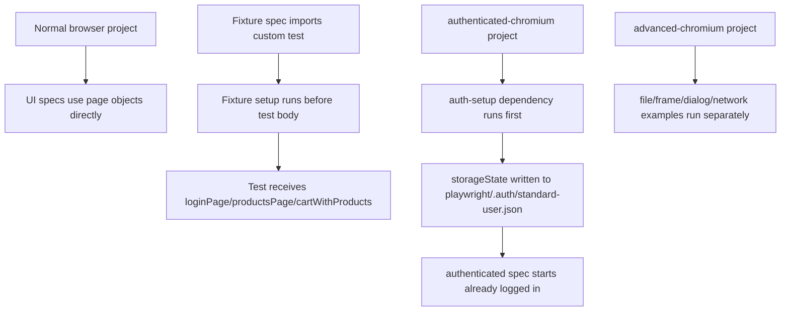

# Module 05 Framework Lifecycle Deep Dive

## Mental Model

Module 05 moves from writing clean tests to controlling the test environment.

Earlier modules mostly used the browser as-is. Module 05 teaches how a framework can prepare richer state before a test starts, reuse authentication, handle browser features that interrupt normal flow, and control network behavior.

At this checkpoint:

- [saucedemo-fixtures.ts](../../src/fixtures/saucedemo-fixtures.ts) creates custom fixtures for common SauceDemo states.
- [auth.setup.ts](../../tests/setup/auth.setup.ts) logs in once and saves storage state.
- [authenticated-products.spec.ts](../../tests/ui/authenticated/authenticated-products.spec.ts) uses saved auth state instead of repeating UI login.
- [file-handling.spec.ts](../../tests/advanced/file-handling.spec.ts) covers upload and download flows.
- [iframes-dialogs.spec.ts](../../tests/advanced/iframes-dialogs.spec.ts) covers frame locators and dialog handling.
- [network-interception.spec.ts](../../tests/advanced/network-interception.spec.ts) covers route mocking, blocking, and request observation.
- [playwright.config.ts](../../playwright.config.ts) adds specialized projects for advanced and authenticated tests.

The big idea is controlled setup. A mature UI framework should not rely only on clicking through every precondition in every test.

## Execution Flow

Module 05 has three important execution paths.



The runner still controls isolation. Fixtures and auth state give each test a cleaner starting point, but each test still runs in a Playwright-managed context.

## Code Walkthrough

Start with [src/fixtures/saucedemo-fixtures.ts](../../src/fixtures/saucedemo-fixtures.ts). It imports `test as base` and extends it:

```ts
export const test = base.extend<SauceDemoFixtures>({ ... });
```

This creates a new `test` object with extra fixtures. Specs that import from this file can request `productsPage` or `cartWithProducts` directly.

The fixture lifecycle is controlled by `use`:

```ts
productsPage: async ({ page }, use) => {
  const loginPage = new LoginPage(page);
  const productsPage = new ProductsPage(page);

  await loginPage.goto();
  await loginPage.login(SauceDemoUsers.standard);
  await use(productsPage);
}
```

Everything before `await use(productsPage)` is setup. The test body runs while `use` is active. If teardown were needed, it would go after the `use` call.

[products-fixtures.spec.ts](../../tests/ui/products/products-fixtures.spec.ts) and [cart-fixtures.spec.ts](../../tests/ui/cart/cart-fixtures.spec.ts) show the payoff. The spec title and assertions focus on behavior because the repeated login and cart setup live in the fixture.

Next read [tests/setup/auth.setup.ts](../../tests/setup/auth.setup.ts). It logs in through the UI one time and writes:

```ts
await page.context().storageState({ path: standardUserAuthFile });
```

[playwright.config.ts](../../playwright.config.ts) wires this into project dependencies. The `authenticated-chromium` project depends on `auth-setup` and uses `storageState: standardUserAuthFile`. That means [authenticated-products.spec.ts](../../tests/ui/authenticated/authenticated-products.spec.ts) can open `/inventory.html` without performing login steps inside the test.

[file-handling.spec.ts](../../tests/advanced/file-handling.spec.ts) uses local HTML through `page.setContent`. This keeps the examples deterministic and avoids depending on a third-party file upload page.

[iframes-dialogs.spec.ts](../../tests/advanced/iframes-dialogs.spec.ts) shows two browser behaviors that often surprise beginners:

- iframe content must be targeted through `frameLocator`
- dialogs must be handled before the click would otherwise block the page

[network-interception.spec.ts](../../tests/advanced/network-interception.spec.ts) shows that Playwright can observe and control browser requests. `page.route` can fulfill a mock response or abort matching requests before the browser completes them.

## TypeScript And Framework Syntax To Notice

`test as base` renames the imported Playwright test object so this file can export its own extended `test`.

`base.extend<SauceDemoFixtures>(...)` adds typed fixtures. The generic type tells TypeScript which fixture names and object types specs can request.

`await use(value)` is the fixture handoff point. Setup happens before it; the test consumes `value`; optional cleanup happens after it.

`export { expect }` lets fixture specs import both `test` and `expect` from one framework fixture module.

`dependencies: ['auth-setup']` in [playwright.config.ts](../../playwright.config.ts) makes one project run before another.

`storageState` reuses browser context cookies and local storage. It is not the same as skipping authentication forever; it reuses a captured authenticated state for tests that need it.

`page.once('dialog', async (dialog) => { ... })` registers a one-time dialog handler. It must be registered before the action that opens the dialog.

`page.route(...)` intercepts network requests matching a pattern. The handler can `fulfill`, `abort`, or continue a request.

If you are coming from Java:

- Custom fixtures are similar to typed setup dependencies injected into test methods.
- `use` is like the boundary between setup and the actual test method.
- `storageState` is comparable to reusing a prepared browser session object.
- `page.route` is similar in purpose to a test double or HTTP stub.

## Responsibility Boundaries

Fixtures should prepare reusable state, not hide the purpose of a test. A fixture named `cartWithProducts` is clear because it describes the state it provides.

Auth setup should create the storage file. Authenticated tests should consume that file but should not know the login mechanics.

Advanced specs under [tests/advanced](../../tests/advanced/file-handling.spec.ts) should teach browser mechanics in isolation. They are not SauceDemo business workflow tests.

Project configuration should route specialized tests to specialized projects. [playwright.config.ts](../../playwright.config.ts) keeps API, advanced, setup, authenticated, and normal browser specs from stepping on each other.

Generated auth state belongs under [playwright/.auth/](../../playwright/.auth) and should stay ignored except for placeholder files needed to preserve the folder.

## Common Mistakes

Do not import `test` from `@playwright/test` in fixture specs that need custom fixtures. Import from [saucedemo-fixtures.ts](../../src/fixtures/saucedemo-fixtures.ts).

Do not put too many unrelated actions into one fixture. A broad fixture makes failures harder to diagnose.

Do not commit generated `standard-user.json` auth state. It is environment-specific output.

Do not register a dialog handler after clicking the button. The dialog can block the page before your handler exists.

Do not use network mocking for every UI test. Mocking is powerful, but overuse can make tests stop representing the real application.

Do not run advanced examples in every normal browser project unless that is intentional. They are separated to keep the standard UI suite focused.

## Debugging And Failure Model

If a fixture test fails before the test body, inspect the fixture setup in [saucedemo-fixtures.ts](../../src/fixtures/saucedemo-fixtures.ts). The failure may happen during login or cart preparation.

If authenticated tests fail with a missing storage file, run:

```bash
npm run test:authenticated
```

The project dependency should run `auth-setup` first and generate `playwright/.auth/standard-user.json`.

If a file upload test fails, check the path built from `process.cwd()` and the presence of [upload-sample.txt](../../test-data/upload-sample.txt).

If a dialog test hangs, check that `page.once('dialog', ...)` appears before the click that triggers the dialog.

If a network interception test fails, check whether the route pattern matches the exact URL requested by the page.

## Interview Readiness

A strong Module 05 explanation is:

"I used custom fixtures for repeatable authenticated and cart states, project dependencies for saved auth state, and separate advanced projects for browser features like files, dialogs, frames, and network interception. This keeps normal tests readable while still showing how the framework can control setup, browser state, and external dependencies when needed."

Be ready to explain the difference between a fixture and a page object. A page object models a page. A fixture prepares or provides test dependencies, which may include page objects already placed into a useful state.

Be ready to explain why saved auth state speeds tests but does not replace login coverage. Login still needs direct tests; auth state is for tests where login is only a precondition.

## Revision Checklist

Before moving beyond Module 05, confirm you can answer:

- Why does the fixture module export its own `test`?
- What does `await use(productsPage)` mean?
- Which specs use custom fixtures?
- How is `playwright/.auth/standard-user.json` generated?
- Why should generated auth state not be committed?
- Why must dialog handlers be registered before the click?
- What is the difference between `frameLocator` and a normal locator?
- What can `page.route` do to a matching request?
- Why are advanced tests separated into their own project?
