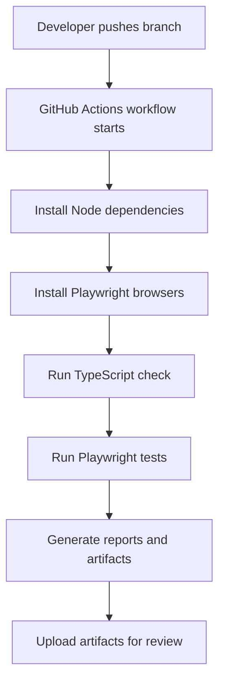
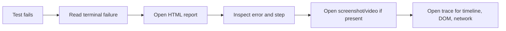

# Module 06: Reporting And CI/CD

## What This Module Adds

Module 06 turns the test framework from a local learning suite into something a team can run, inspect, and trust in continuous integration.

Earlier modules answered:

- Can we write Playwright tests?
- Can we organize framework code?
- Can we create reusable page objects and fixtures?
- Can we test UI, API, auth state, files, dialogs, frames, and network behavior?

Module 06 answers:

- When a test fails, where do we look?
- What reports are generated?
- Which artifacts are safe to archive?
- How does CI install dependencies and browsers?
- How does GitHub Actions run the same framework without a developer laptop?

## Files Added Or Changed

| File | Status | Purpose |
|---|---|---|
| `playwright.config.ts` | changed | Adds JSON, JUnit, Allure, and custom summary reporters; adds a reporting project |
| `package.json` | changed | Adds Allure/reporting/CI scripts and dev dependencies |
| `.gitignore` | changed | Ignores generated report folders and CI artifacts |
| `reporters/console-summary-reporter.ts` | added | Demonstrates a small custom reporter |
| `tests/reporting/artifact-capture.spec.ts` | added | Demonstrates manual screenshot attachment and report artifact output |
| `.github/workflows/playwright.yml` | added | Runs typecheck/tests in GitHub Actions and uploads artifacts |
| `docs/module-06-reporting-cicd/*` | added | Explains reporting, traces, Allure, CI, and debugging workflow |

## Reporting Layers

Module 06 uses multiple reporting layers because each layer serves a different audience.

| Layer | Output | Audience |
|---|---|---|
| Console list reporter | terminal output | developer running tests now |
| HTML report | `reports/playwright-html` | developer debugging a run interactively |
| JSON report | `reports/test-results/results.json` | tools/scripts that parse structured results |
| JUnit report | `reports/test-results/junit.xml` | CI systems that understand test result XML |
| Allure results | `reports/allure-results` | richer historical/interactive reporting |
| Custom reporter | console summary | learning how reporters hook into Playwright |
| Artifacts | `reports/test-artifacts` | screenshots, videos, traces, downloads, attachments |

## Why Reports Are Not Committed

Reports are generated output. They can be large and change on every run.

Git should track:

- config
- source code
- tests
- docs
- workflow definitions

Git should not track:

- screenshots
- videos
- traces
- generated HTML reports
- generated Allure reports
- auth storage state

CI uploads those generated artifacts for each run instead.

## How To Read A Failure

The trace is usually the richest artifact because it shows actions, snapshots, network, console, and timing.

## Quality Gate

Module 06 is complete when:

- `npm run typecheck` passes
- `npm run test:reporting` passes
- `npm run test:allure` generates Allure result files
- `npm run test:ci` passes
- GitHub Actions workflow exists and uploads report artifacts
- docs explain each reporting output and correctly reference the implemented files
