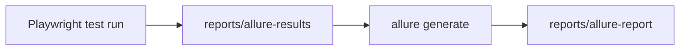

# Allure And Custom Reporters

## Why Add Allure If Playwright Has HTML Reports?

Playwright's HTML report is excellent for debugging one run. Allure is useful when teams want richer test report structure, metadata, categories, and historical reporting outside the Playwright report UI.

Module 06 adds Allure as a learning integration, not because every project must use it.

## Allure Results vs Allure Report

Allure has two phases:



[reports/allure-results](../../reports/allure-results) contains raw result files.

[reports/allure-report](../../reports/allure-report) is the generated HTML report.

## Configured Allure Reporter

[playwright.config.ts](../../playwright.config.ts) includes:

```ts
[
    'allure-playwright',
    {
      detail: true,
      resultsDir: 'reports/allure-results',
      suiteTitle: true,
    },
]
```

The important option is `resultsDir`, because it keeps generated files under the ignored `reports/` tree.

## Allure Scripts

[package.json](../../package.json) includes:

```json
{
  "test:allure": "playwright test --project=reporting-chromium",
  "allure:generate": "allure generate reports/allure-results --clean -o reports/allure-report",
  "allure:open": "allure open reports/allure-report",
  "allure:serve": "allure serve reports/allure-results",
  "test:summary": "playwright test --project=reporting-chromium --reporter=./reporters/console-summary-reporter.ts"
}
```

Suggested workflow:

```bash
npm run test:allure
npm run allure:generate
npm run allure:open
```

## Allure Metadata Through Playwright Annotations

Playwright supports annotations through `test.info().annotations`.

[tests/reporting/artifact-capture.spec.ts](../../tests/reporting/artifact-capture.spec.ts) uses annotations to demonstrate report metadata:

```ts
testInfo.annotations.push({
  type: 'severity',
  description: 'normal',
});
```

Metadata should clarify reporting, not hide test logic. Keep business behavior in the test title and assertions.

## Custom Reporter

Module 06 adds [reporters/console-summary-reporter.ts](../../reporters/console-summary-reporter.ts).

A custom reporter hooks into Playwright's reporting lifecycle:

```ts
onBegin(config, suite) {
  console.log(`Starting test run with ${suite.allTests().length} tests`);
}

onTestEnd(test, result) {
  console.log(`${result.status} ${test.title}`);
}
```

This repo's custom reporter is deliberately small. It teaches the extension point without replacing Playwright's built-in reporters.

Run it directly:

```bash
npm run test:summary
```

The custom reporter is intentionally not part of the default configured reporter list because it prints one line per test. Keeping it as a script makes the concept available without making every full-suite run noisier.

## When To Avoid Custom Reporters

Avoid custom reporters when a built-in reporter already solves the problem.

Custom reporters are useful when:

- a team needs a specific summary format
- test results must be sent to an internal system
- reporting conventions are unique to the organization

They are costly when:

- they duplicate built-in features
- they make output too noisy
- nobody maintains them

## Code References

Read:

- [reporters/console-summary-reporter.ts](../../reporters/console-summary-reporter.ts)
- [playwright.config.ts](../../playwright.config.ts)
- [tests/reporting/artifact-capture.spec.ts](../../tests/reporting/artifact-capture.spec.ts)
- [package.json](../../package.json)
