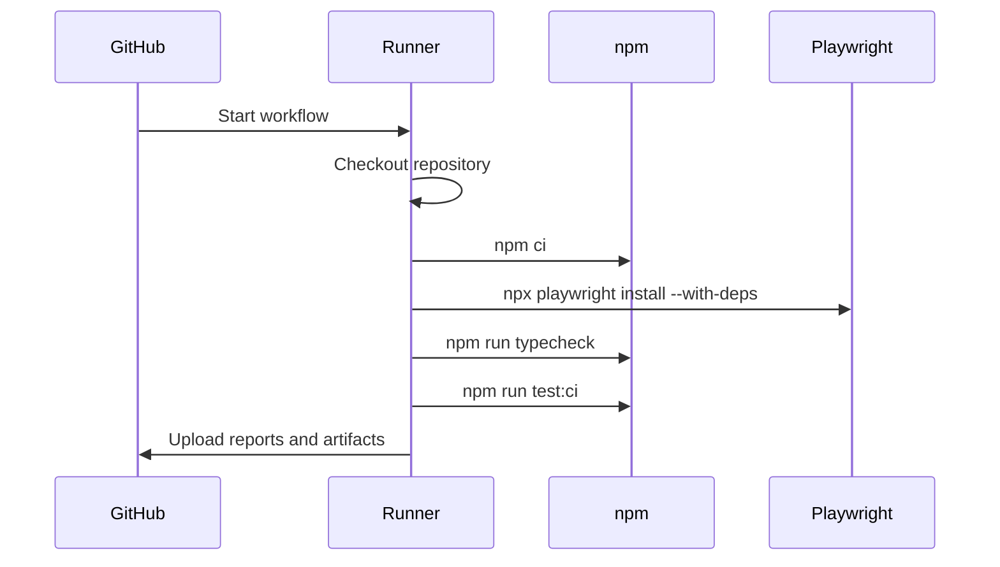

# GitHub Actions CI/CD

## What CI Adds

Local tests answer: "Does this work on my machine?"

CI answers: "Does this work in a clean repeatable environment?"

That difference matters. CI starts from a fresh checkout, installs dependencies from the lockfile, installs browsers, and runs the same commands a reviewer should trust.

## Workflow File

Module 06 adds:

```text
.github/workflows/playwright.yml
```

The workflow runs on:

- pushes to `main`
- pushes to module branches
- pull requests targeting `main`

## CI Job Flow



## Why `npm ci`

CI uses:

```bash
npm ci
```

instead of:

```bash
npm install
```

`npm ci` installs exactly from `package-lock.json` and fails if the lockfile is out of sync. That is better for repeatable CI.

## Why Install Playwright Browsers In CI

Playwright tests need browser binaries. The workflow runs:

```bash
npx playwright install --with-deps
```

`--with-deps` installs Linux system dependencies required by the browsers on the GitHub runner.

## CI Test Script

Module 06 adds:

```json
"test:ci": "playwright test"
```

This script currently runs the same configured suite as `npm test`, but it gives CI its own stable command. Later modules can tune `test:ci` without changing the local default.

## Artifact Upload

The workflow uploads:

- `reports/playwright-html`
- `reports/test-results`
- `reports/allure-results`
- `reports/test-artifacts`

The upload runs with `if: always()` so reports are available even when tests fail.

## Notifications

The source material mentions Slack/email notifications. This module does not add real notifications because that requires workspace-specific secrets and destinations.

What we do instead:

- keep the workflow ready for artifact review
- document where notification steps would belong
- avoid committing fake webhook secrets

In a real team, a Slack notification step would usually run after tests and read the job status.

## Code References

Read:

- `.github/workflows/playwright.yml`
- `package.json`
- `playwright.config.ts`
