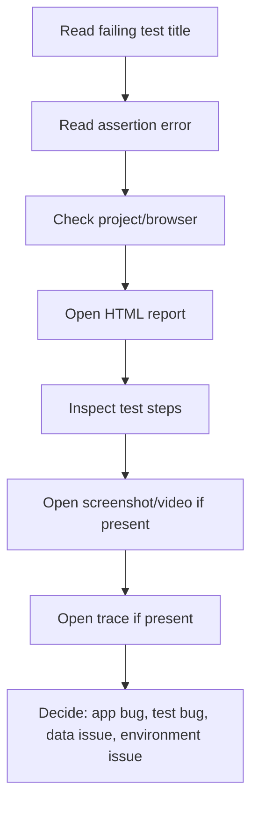

# Debugging Failures With Reports

## Failure Debugging Workflow

When a test fails, use a consistent workflow instead of changing code randomly.



## Step 1: Identify The Scope

Ask:

- Did it fail in all browsers or one browser?
- Did it fail in UI, API, advanced, or authenticated project?
- Did setup fail before the actual test?

The project name in the report matters. A WebKit-only failure has a different investigation path than a failure across all browsers.

## Step 2: Read The Assertion

A good assertion tells you what behavior was expected:

```ts
await expect(productsPage.title).toHaveText('Products');
```

This failure means the page did not show the expected product title in time.

Avoid weak assertions because they create weak failure messages.

## Step 3: Use Steps

Tests with `test.step` show conceptual phases in reports:

- Arrange
- Act
- Assert

If a failure appears in "Arrange," the app may not have reached the starting state. If it appears in "Assert," the action happened but the outcome was wrong.

## Step 4: Inspect Artifacts

Artifacts answer different questions:

| Artifact | Best For |
|---|---|
| Screenshot | final visual state at failure |
| Video | movement and sequence leading to failure |
| Trace | actions, DOM snapshots, network, console, timing |
| JSON report | machine-readable result processing |
| JUnit report | CI result integration |
| Allure report | richer report navigation and metadata |

## Step 5: Classify The Failure

Use a simple classification:

- product bug: the app behavior is wrong
- test bug: the test expectation or locator is wrong
- data bug: credentials or test data are wrong
- environment issue: target site, network, browser install, or CI runner issue

Classification prevents wasted fixes. A product bug should not be solved by weakening the test.

## Local Commands

Run a focused test:

```bash
npm run test:login
```

Run a reporting example:

```bash
npm run test:reporting
```

Open HTML report:

```bash
npm run report
```

Generate Allure report:

```bash
npm run allure:generate
```

## Key Takeaways

- Reports are debugging tools, not decoration.
- The first question is always "what failed, where, and in which project?"
- Screenshots show final state; traces show how the test got there.
- CI artifacts must be uploaded even on failure.
