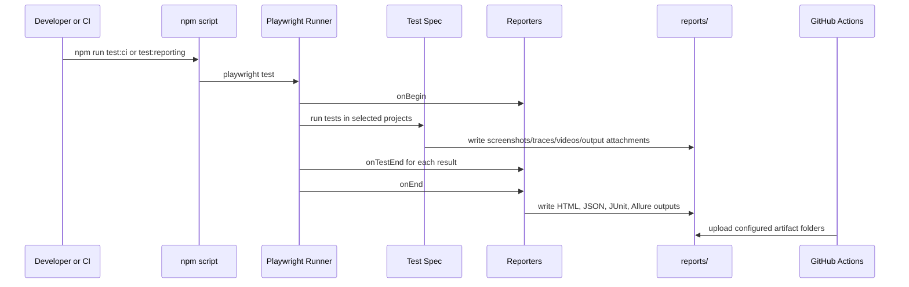

# Module 06 Framework Lifecycle Deep Dive

## Mental Model

Module 06 makes test results portable and reviewable.

Before this checkpoint, a developer could run tests locally and read terminal output. That is not enough for team automation. A CI-ready framework needs structured results, human-readable reports, failure artifacts, and a repeatable workflow that runs away from the developer machine.

At this checkpoint:

- [playwright.config.ts](../../playwright.config.ts) writes list, HTML, JSON, JUnit, and Allure outputs.
- [artifact-capture.spec.ts](../../tests/reporting/artifact-capture.spec.ts) demonstrates manual screenshot attachment.
- [console-summary-reporter.ts](../../reporters/console-summary-reporter.ts) shows how a custom reporter receives lifecycle events.
- [playwright.yml](../../.github/workflows/playwright.yml) installs dependencies, installs browsers, type-checks, runs tests, and uploads report artifacts.
- [package.json](../../package.json) exposes reporting and CI commands.

The key lesson is that a test run produces evidence. Module 06 teaches where that evidence goes and how a teammate or interviewer can inspect it.

## Execution Flow

The reporting lifecycle starts before the first test and continues after the last test finishes.



Reports are generated output. They are ignored by Git but uploaded by CI so each run keeps its own evidence bundle.

## Code Walkthrough

Start with [playwright.config.ts](../../playwright.config.ts). The reporter list now includes:

- `list` for immediate terminal feedback
- `html` for interactive local debugging
- `json` for structured machine-readable results
- `junit` for CI systems that understand XML test results
- `allure-playwright` for Allure result generation

The config also adds `reporting-chromium`, which runs specs under [tests/reporting](../../tests/reporting/artifact-capture.spec.ts). Normal browser projects ignore reporting specs so the demonstration artifact test does not run as part of every browser matrix entry.

Next inspect [tests/reporting/artifact-capture.spec.ts](../../tests/reporting/artifact-capture.spec.ts). It uses `testInfo` for two important reporting operations:

- `testInfo.annotations.push(...)` adds metadata to the result.
- `testInfo.attach(...)` attaches a named screenshot to the report.

This spec creates a tiny in-memory page with `page.setContent`, verifies the heading, takes a screenshot, and attaches it. The goal is not to test SauceDemo; the goal is to teach artifact capture.

Then read [reporters/console-summary-reporter.ts](../../reporters/console-summary-reporter.ts). A custom reporter implements Playwright's `Reporter` interface. It receives lifecycle callbacks:

- `onBegin` when the run starts
- `onTestEnd` after each test attempt ends
- `onEnd` when the run finishes

The reporter counts statuses and prints a compact summary. It is intentionally small so the lifecycle is clear.

Finally inspect [.github/workflows/playwright.yml](../../.github/workflows/playwright.yml). The workflow runs on pushes to `main` and `module-*` branches and on pull requests to `main`. It uses `npm ci` for repeatable dependency installation, installs Playwright browsers with system dependencies, runs TypeScript checking, runs the suite, and uploads generated reports even when tests fail.

## TypeScript And Framework Syntax To Notice

The reporter imports types from `@playwright/test/reporter`, not from the normal test package. Reporter APIs have their own lifecycle types.

`implements Reporter` tells TypeScript that the class follows Playwright's reporter contract.

`onBegin(_config: FullConfig, suite: Suite): void` uses `_config` to show the argument is intentionally unused.

`TestResult['status']` reuses the exact status type from Playwright instead of inventing a separate union.

`testInfo.outputPath('module-06-report-artifact.png')` asks Playwright for a test-specific output location. This prevents tests from writing over each other's files.

`if: always()` in the GitHub Actions upload step means artifacts are uploaded even after failures. That is essential because failed runs are when reports matter most.

If you are coming from Java:

- Playwright reporters are similar in purpose to test listeners.
- JUnit XML is the bridge format many CI systems use to understand test results.
- `testInfo` is like a per-test context object for metadata and artifacts.
- GitHub Actions workflow YAML is the CI pipeline definition, similar to Jenkinsfile or other CI job configuration.

## Responsibility Boundaries

[playwright.config.ts](../../playwright.config.ts) owns report output configuration and project routing.

Specs own meaningful attachments only when the attachment teaches or proves something. [artifact-capture.spec.ts](../../tests/reporting/artifact-capture.spec.ts) attaches a screenshot because the module is about reporting.

The custom reporter owns terminal summary behavior. It should not change test behavior or make assertions.

The GitHub Actions workflow owns CI orchestration: environment setup, dependency install, test execution, and artifact upload.

[.gitignore](../../.gitignore) owns the boundary between source and generated output. Report folders are generated and should stay out of commits.

## Common Mistakes

Do not commit generated reports. They change every run and make history noisy.

Do not rely only on terminal logs for debugging CI failures. Upload HTML, JSON/JUnit, Allure results, and test artifacts.

Do not attach huge artifacts to every passing test. Artifacts are useful, but excessive output slows CI and makes reports harder to scan.

Do not let the custom reporter make test decisions. Reporters observe results; tests and fixtures control behavior.

Do not run `npm install` in CI when a lockfile exists. `npm ci` is better for repeatable installs.

Do not skip browser installation in GitHub Actions. Playwright tests need the browser binaries and OS dependencies.

## Debugging And Failure Model

When a local reporting test fails, run:

```bash
npm run test:reporting
```

Then open the HTML report:

```bash
npm run report
```

When Allure output needs verification, run:

```bash
npm run test:allure
npm run allure:generate
```

When CI fails, inspect the failure in this order:

1. GitHub Actions step that failed.
2. Terminal error in the failed step.
3. Uploaded `playwright-reports` artifact.
4. HTML report for failing test details.
5. Trace, screenshot, or video if available.
6. JSON/JUnit output if another tool needs structured result details.

If no artifact appears, check the upload step path and confirm `if: always()` is still present.

## Interview Readiness

A strong Module 06 explanation is:

"I configured multiple reporting outputs because each serves a different consumer: console for immediate feedback, HTML for debugging, JSON and JUnit for tooling and CI, Allure for richer reporting, and artifacts for screenshots, videos, traces, and attachments. GitHub Actions runs the same scripts a developer uses locally and uploads generated evidence even on failed runs."

Be ready to explain why reports are ignored by Git but uploaded by CI. Source control tracks the framework; CI stores run-specific evidence.

Be ready to explain when you would use a custom reporter. A custom reporter is useful for organization-specific summaries or integrations, but it should stay observational.

## Revision Checklist

Before moving beyond Module 06, confirm you can answer:

- Which report outputs are configured in Playwright?
- What folder contains Playwright HTML output?
- What is the difference between JSON and JUnit outputs?
- Why does the reporting spec use `testInfo`?
- What reporter lifecycle methods does the custom reporter implement?
- Why does GitHub Actions use `npm ci`?
- Why does the workflow upload artifacts with `if: always()`?
- Which generated report folders should not be committed?
