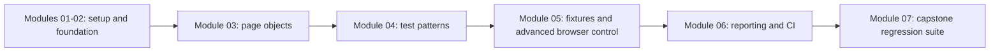

# Module 07: Capstone Real World Project

## What This Module Builds

Module 07 is the capstone. Modules 01-06 taught the individual skills: Playwright basics, framework setup, page objects, test design, fixtures, advanced browser features, reporting, and CI.

Module 07 combines those skills into a portfolio-grade SauceDemo suite.

The source curriculum describes a fresh portfolio project. This repository intentionally does something different: it extends the same framework from Modules 01-06 so the learner can see how a real automation framework grows without throwing away earlier work.



## Capstone Target

The source material targets 103 logical tests:

| Area | Logical Tests |
|---|---:|
| Login and authentication | 14 |
| Product browsing | 24 |
| Shopping cart | 23 |
| Checkout | 27 |
| API-style coverage | 15 |
| Total | 103 |

Important distinction:

- logical test count means how many behaviors the suite defines
- execution count means how many times Playwright runs those tests across configured projects

If 88 UI tests run on Chromium, Firefox, and WebKit, that becomes 264 UI executions. API tests run once in the API project.

## Where Module 07 Code Lives

Module 07 adds capstone-specific tests under:

```text
tests/ui/capstone/
  auth/
  products/
  cart/
  checkout/
tests/api/capstone/
```

The earlier learning specs remain in place. Keeping capstone tests separate makes the final portfolio suite easy to review without losing the module-by-module examples.

## Files Added Or Changed

| File | Purpose |
|---|---|
| `src/types/capstone.ts` | Shared capstone data shapes |
| `src/utils/capstone-data.ts` | Product, login, checkout, and API test data |
| `src/page-objects/ProductsPage.ts` | Adds capstone helpers for product details and menu/logout |
| `src/page-objects/CartPage.ts` | Adds cart display and empty-cart helpers |
| `src/page-objects/CheckoutPage.ts` | Adds overview, totals, and navigation helpers |
| `playwright.config.ts` | Keeps capstone UI tests on desktop browsers, not mobile |
| `tests/ui/capstone/**` | 88 logical UI capstone tests |
| `tests/api/capstone/**` | 15 logical API-style capstone tests |

## What Makes The Capstone Portfolio-Grade

The suite should show more than raw test quantity.

A reviewer should see:

- clear domain organization
- readable page object usage
- data-driven tests where repetition would be noisy
- direct tests where behavior is unique
- strong assertions tied to user-visible outcomes
- risk-focused coverage across positive, negative, and edge cases
- reporting and CI support from Module 06

## Quality Gate

Module 07 is complete when:

- capstone docs explain the suite structure and test inventory
- 103 logical capstone tests exist
- capstone tests reference actual framework files
- TypeScript passes
- the capstone UI and API suites pass
- `npm run test:ci` passes
- `main` is fast-forwarded to the completed Module 07 branch and tagged `module-07-complete`
