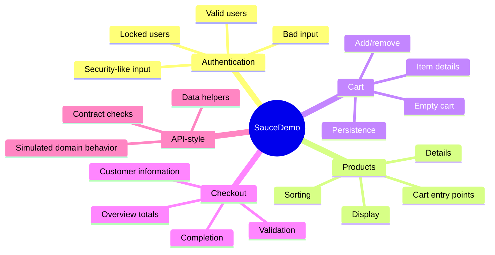

# Capstone Test Strategy

## Strategy Before Code

A large suite should not be a pile of tests. It needs a strategy.

The capstone strategy is:

1. test the highest-value SauceDemo user journeys
2. organize tests by domain area
3. use page objects for UI mechanics
4. use data-driven tests for repeated behavior patterns
5. keep tests independent
6. make failures diagnosable through assertions, steps, and reports

## SauceDemo Risk Areas



## Test Independence

Every test creates its own state. A product test logs in before it acts. A checkout test adds products before checkout. A cart test does not depend on a product test running first.

This matters because Playwright can run tests in parallel. If tests depend on order, parallel execution exposes that weakness.

## Data-Driven vs Explicit Tests

Use data-driven tests when:

- the behavior is the same
- only input and expected result change
- test titles can still identify the case

Use explicit tests when:

- the behavior has unique steps
- the failure needs a focused title
- a data table would hide important intent

Module 07 uses both styles.

## Assertion Standards

Each capstone UI test should assert one or more meaningful outcomes:

- URL changed to expected route
- page title or heading is visible
- cart badge count changed
- product names/prices/descriptions match expected data
- checkout error message appears
- order completion message is shown

Avoid tests that only click without verifying behavior.

## API-Style Coverage In This Repo

SauceDemo does not expose a public documented API for the flows we automate. The capstone API tests therefore use local domain helpers and public API examples to teach API-style thinking:

- contract shape
- status/result semantics
- filtering
- cart summary calculations
- user credential validation logic

The docs call these "API-style" tests because they exercise request/response and domain-contract patterns without pretending SauceDemo has a real public backend API for every UI action.

## Execution Plan

Module 07 adds focused scripts:

```bash
npm run test:capstone:ui
npm run test:capstone:api
npm run test:capstone
```

The full CI command remains:

```bash
npm run test:ci
```

Use focused scripts while developing. Use `test:ci` before completing the module.
