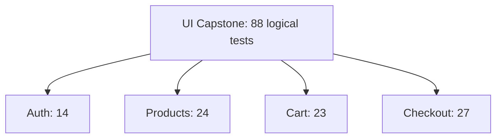

# UI Suite Design

## UI Coverage Map

Module 07 adds 88 logical UI tests.



## Authentication Tests

Authentication tests live in:

```text
tests/ui/capstone/auth/login-capstone.spec.ts
```

They cover:

- 5 valid users
- 7 invalid/security-like input cases
- 2 empty-field validation cases

They use:

- `LoginPage`
- `ProductsPage`
- `SauceDemoUsers`
- `CapstoneInvalidLoginCases`

## Product Tests

Product tests live in:

```text
tests/ui/capstone/products/products-capstone.spec.ts
```

They cover:

- display verification
- sorting
- add/remove cart operations
- navigation
- product information
- menu/logout behavior

They use:

- `ProductsPage`
- typed product data from [src/utils/capstone-data.ts](../../src/utils/capstone-data.ts)
- `ProductSortOption`

## Cart Tests

Cart tests live in:

```text
tests/ui/capstone/cart/cart-capstone.spec.ts
```

They cover:

- adding items to cart
- removing items from inventory and cart
- cart navigation
- cart calculations
- item details
- empty cart scenarios
- persistence during navigation

Cart tests use real UI setup instead of sharing state from previous tests.

## Checkout Tests

Checkout tests live in:

```text
tests/ui/capstone/checkout/checkout-capstone.spec.ts
```

They cover:

- valid customer information
- form validation
- navigation
- overview page
- item totals and tax
- complete order behavior
- end-to-end checkout scenarios

Checkout tests use helpers to set up cart state, but the assertions remain in the specs so the behavior is visible to the learner.

## Browser Multiplication

Capstone UI tests run on:

- Chromium
- Firefox
- WebKit

They are intentionally excluded from the mobile project so the capstone target maps to the source material's "88 UI tests on 3 browsers" idea.

## Code References

Read:

- [src/utils/capstone-data.ts](../../src/utils/capstone-data.ts)
- [tests/ui/capstone/auth/login-capstone.spec.ts](../../tests/ui/capstone/auth/login-capstone.spec.ts)
- [tests/ui/capstone/products/products-capstone.spec.ts](../../tests/ui/capstone/products/products-capstone.spec.ts)
- [tests/ui/capstone/cart/cart-capstone.spec.ts](../../tests/ui/capstone/cart/cart-capstone.spec.ts)
- [tests/ui/capstone/checkout/checkout-capstone.spec.ts](../../tests/ui/capstone/checkout/checkout-capstone.spec.ts)
