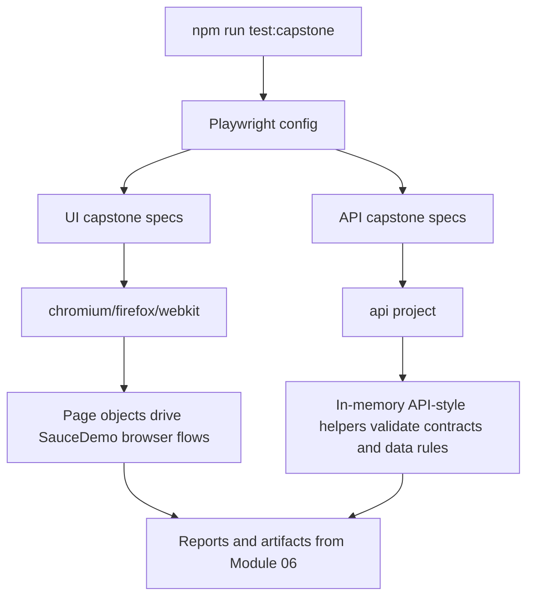

# Module 07 Framework Lifecycle Deep Dive

## Mental Model

Module 07 is the proof that the learning framework can scale into a realistic regression suite.

The capstone does not replace the earlier learning specs. It adds a focused suite under [tests/ui/capstone](../../tests/ui/capstone/auth/login-capstone.spec.ts) and [tests/api/capstone](../../tests/api/capstone/capstone-api.spec.ts) so a reviewer can separate teaching examples from portfolio-grade coverage.

At this checkpoint, the framework combines:

- Page objects from Module 03.
- Data-driven test design from Module 04.
- Fixture and project strategy from Module 05.
- Reporting and CI support from Module 06.
- Capstone-specific data and types in [capstone-data.ts](../../src/utils/capstone-data.ts) and [capstone.ts](../../src/types/capstone.ts).

The goal is not just "more tests." The goal is risk-focused coverage organized by domain: authentication, products, cart, checkout, and API-style contracts.

## Execution Flow

The capstone execution flow starts with the same Playwright runner, but routes capstone UI tests through desktop browser projects and capstone API-style tests through the API project.



[playwright.config.ts](../../playwright.config.ts) keeps capstone UI tests out of the mobile project with `mobileProjectIgnore`. That decision is intentional for this checkpoint: the capstone target is desktop regression coverage.

## Code Walkthrough

Start with [src/types/capstone.ts](../../src/types/capstone.ts). It defines the shared data shapes for the capstone:

- `CapstoneProduct` describes product name, price, and description.
- `InvalidLoginCase` and `ValidLoginCase` describe authentication scenarios.
- `CheckoutValidationCase` describes form validation data.
- `ApiResult<TBody>` describes API-style helper responses.

Then read [src/utils/capstone-data.ts](../../src/utils/capstone-data.ts). This file centralizes the capstone data set:

- `CapstoneProducts` is the source of expected product names, prices, and description fragments.
- `CapstoneProductNames` derives the ordered product-name list.
- `CapstoneProductPriceByName` maps product names to expected prices.
- `ValidLoginCases`, `InvalidCredentialCases`, and `EmptyFieldCases` drive login coverage.
- `ValidCheckoutCustomers` and `CheckoutValidationCases` drive checkout coverage.

The page objects were also expanded for capstone needs:

- [ProductsPage](../../src/page-objects/ProductsPage.ts) adds helpers for prices, descriptions, product details, menu, logout, and reset state.
- [CartPage](../../src/page-objects/CartPage.ts) adds item quantity, `hasItem`, and cart list helpers.
- [CheckoutPage](../../src/page-objects/CheckoutPage.ts) adds cancel, overview item, subtotal, tax, total, payment, and shipping helpers.

The UI capstone specs use those helpers by domain:

- [login-capstone.spec.ts](../../tests/ui/capstone/auth/login-capstone.spec.ts) covers valid users, invalid credentials, and empty-field validation.
- [products-capstone.spec.ts](../../tests/ui/capstone/products/products-capstone.spec.ts) covers catalog display, sorting, cart operations, product details, and logout.
- [cart-capstone.spec.ts](../../tests/ui/capstone/cart/cart-capstone.spec.ts) covers adding, removing, navigation, calculations, persistence, and empty-cart behavior.
- [checkout-capstone.spec.ts](../../tests/ui/capstone/checkout/checkout-capstone.spec.ts) covers customer validation, navigation, overview, totals, completion, and end-to-end purchase paths.

[capstone-api.spec.ts](../../tests/api/capstone/capstone-api.spec.ts) is API-style rather than a real external API integration. It uses pure helper functions such as `authenticate`, `getProductByName`, and `buildCartSummary` to practice contract thinking and business-rule checks without depending on a backend that SauceDemo does not expose.

## TypeScript And Framework Syntax To Notice

`as const satisfies readonly CapstoneProduct[]` keeps product data immutable and checks that every product matches the expected shape.

`Object.fromEntries(...) as Record<SauceDemoProductName, string>` builds a lookup table from product data. This avoids repeating price expectations across tests.

`for (const [index, customer] of ValidCheckoutCustomers.entries())` generates readable data-driven checkout tests while preserving the customer index in the test title.

`type Page` is imported in some capstone specs so helper functions can accept Playwright's `page` fixture explicitly.

Helper functions inside specs, such as `loginAsStandardUser` and `openCheckoutOverview`, reduce repeated setup within one domain without creating premature global utilities.

`ApiResult<TBody>` is a generic type. It lets API-style helpers return different body shapes while keeping the same `status` plus `body` response pattern.

If you are coming from Java:

- `CapstoneProducts` is similar to an immutable test data list.
- `Record<SauceDemoProductName, string>` is a typed map.
- Generic `ApiResult<TBody>` is similar to `ApiResult<T>` in Java.
- Local async helper functions in specs play a role similar to private test helper methods.

## Responsibility Boundaries

Capstone data belongs in [capstone-data.ts](../../src/utils/capstone-data.ts), not scattered across 100 tests.

Capstone types belong in [capstone.ts](../../src/types/capstone.ts), so the suite has a shared vocabulary for products, login cases, checkout cases, and API-style responses.

Page objects own reusable SauceDemo screen behavior. They are allowed to grow in Module 07 because capstone tests need more page capabilities.

Capstone specs own scenario grouping and assertions. They should be readable as domain coverage, not as selector scripts.

API-style capstone tests own contract and calculation checks. They intentionally do not use page objects because no browser UI is involved.

The Playwright config owns execution strategy. Desktop browsers run UI capstone tests; the API project runs API-style capstone tests; mobile skips capstone UI tests at this checkpoint.

## Common Mistakes

Do not count browser executions as logical tests. One logical test can execute multiple times across projects.

Do not duplicate product prices directly inside every spec. Use `CapstoneProductPriceByName` or `CapstoneProducts`.

Do not move every repeated setup helper into a global utility. If a helper is only useful inside one spec file, keeping it local improves readability.

Do not treat the API-style capstone as real SauceDemo backend testing. It is contract-style practice built from local data because SauceDemo does not expose the needed ecommerce API.

Do not add capstone UI tests to the mobile project accidentally. Module 07's capstone target is desktop browser coverage.

Do not let page objects become assertion dumping grounds. Capstone specs still own the expected behavior.

## Debugging And Failure Model

If many capstone UI tests fail at once, start with login or setup helpers. Most domain specs begin by logging in as the standard user.

If product or cart expectations fail, inspect [capstone-data.ts](../../src/utils/capstone-data.ts) and the relevant page object helper.

If only one data-driven case fails, read the generated test title. It points to the exact data row.

If checkout failures occur after `continue()`, check whether the test is on information, overview, or complete page. The same `CheckoutPage` object represents multiple checkout screens, so URL and visible controls help identify state.

Useful capstone commands:

```bash
npm run test:capstone:api
npm run test:capstone:ui
npm run test:capstone
```

For a faster local loop, run one domain file:

```bash
npx playwright test tests/ui/capstone/products/products-capstone.spec.ts --project=chromium
```

## Interview Readiness

A strong Module 07 explanation is:

"The capstone extends the existing framework instead of starting over. I organized coverage by SauceDemo domains, centralized capstone data and types, expanded page objects only where the suite needed new behavior, and separated UI regression checks from API-style contract checks. The result is a traceable suite where a reviewer can see test strategy, data design, page abstraction, and CI-ready reporting working together."

Be ready to explain the difference between logical test count and execution count. A 103-test logical suite can produce more executions when UI tests run across Chromium, Firefox, and WebKit.

Be ready to explain why the capstone keeps earlier learning specs. The repository shows both how the framework was learned and how it scales.

## Revision Checklist

Before moving beyond Module 07, confirm you can answer:

- Where do capstone UI specs live?
- Where do capstone API-style specs live?
- Which file owns capstone product and checkout data?
- Which page objects were expanded for capstone support?
- Why is mobile excluded from capstone UI execution?
- What is the difference between a logical test and a browser execution?
- Why does the API-style capstone not use page objects?
- How would you debug one failing data-driven capstone case?
- What makes the capstone portfolio-grade beyond raw test count?
