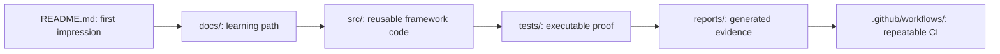

# Module 08: Portfolio And Interview Packaging

## What This Module Does

Module 08 is the final packaging step. The automation framework already exists by the end of Module 07. This module makes the finished work understandable to someone who did not watch the framework grow module by module.

That audience could be:

- your future self returning to the project later
- a reviewer opening the repository for the first time
- a teammate learning the framework structure
- a hiring manager checking whether the project is organized and runnable

This repository intentionally skips standalone portfolio/interview template files. Instead, Module 08 focuses on repository packaging that belongs inside the project:

- a professional `README.md`
- clear documentation for how the framework is structured
- correct commands for tests and reports
- a final review checklist that keeps claims aligned with implemented code

## Why Packaging Matters

Good automation code is not enough if the repository does not explain itself. A reviewer should be able to answer these questions quickly:

- What does this framework test?
- How do I install and run it?
- Which commands run smoke, capstone, API, and CI coverage?
- Where are reports generated?
- How is the framework organized?
- Which modules introduced which concepts?
- Are the claims in the README backed by real files?

The README is the front door. The module docs are the tour. The code is the proof.

## Source Material Versus This Project

The source curriculum includes LinkedIn posts, resume bullets, recruiter messages, and interview prompts. Those are useful career exercises, but this repository is being kept focused on the framework itself.

So Module 08 uses the source material for the main idea: package the project professionally. It does not add standalone career-template artifacts.

The source examples also mention generic numbers like "52 tests." This project must use its own real numbers:

| Metric | Current Project Reality |
|---|---:|
| Module 07 logical capstone tests | 103 |
| `npm run test:capstone` executions | 279 |
| `npm run test:ci` executions at Module 07 checkpoint | 391 |
| Main UI browsers for capstone | Chromium, Firefox, WebKit |
| API-style capstone project | `api` |

The distinction between logical tests and executions is important. A single logical UI test can run multiple times when Playwright executes it across multiple browser projects.

## Module 08 Deliverables

| File | Status | Purpose |
|---|---|---|
| `README.md` | added | Public entry point for installing, running, and understanding the framework |
| `docs/module-08-portfolio-and-interview-packaging/00-module-overview.md` | added | Explains the purpose and scope of Module 08 |
| `docs/module-08-portfolio-and-interview-packaging/01-professional-readme.md` | added | Teaches how the README maps to actual project files |
| `docs/module-08-portfolio-and-interview-packaging/02-github-and-report-packaging.md` | added | Explains badges, CI, reports, generated artifacts, and GitHub presentation |
| `docs/module-08-portfolio-and-interview-packaging/03-final-framework-review.md` | added | Reviews the completed framework architecture and module progression |
| `docs/module-08-portfolio-and-interview-packaging/exercises.md` | added | Provides final packaging exercises without asking the learner to duplicate completed work |

## What Module 08 Does Not Add

Module 08 does not add new framework features. By this point, the project already contains:

- Playwright configuration in `playwright.config.ts`
- environment support through `.env.example` and `dotenv`
- reusable page objects under `src/page-objects/`
- typed test data under `src/types/` and `src/utils/`
- custom fixtures under `src/fixtures/`
- UI, API, advanced, reporting, authenticated, and capstone tests under `tests/`
- CI configuration under `.github/workflows/playwright.yml`
- report generation through Playwright HTML, JSON, JUnit, and Allure

Adding more tests here would blur the learning progression. Module 08 is about explaining and packaging the completed result.

## Quality Gate

Module 08 is complete when:

- `README.md` accurately describes implemented files and scripts
- Module 08 docs explain packaging with project-specific references
- no standalone portfolio/interview materials are added
- `npm run typecheck` passes
- `npm run test:reporting:allure` passes
- `npm run test:capstone:api` passes
- `npm run test:ci` passes
- the module branch is marked complete, merged to `main`, and tagged `module-08-complete`
