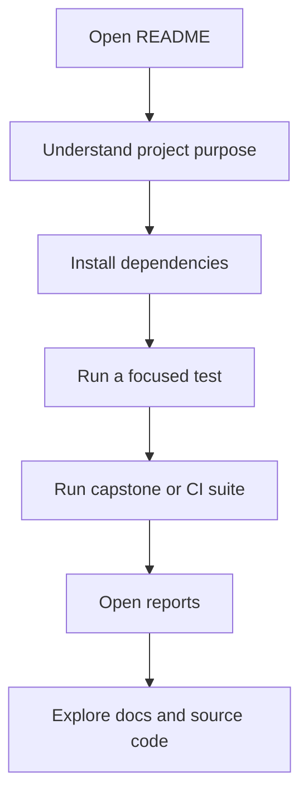
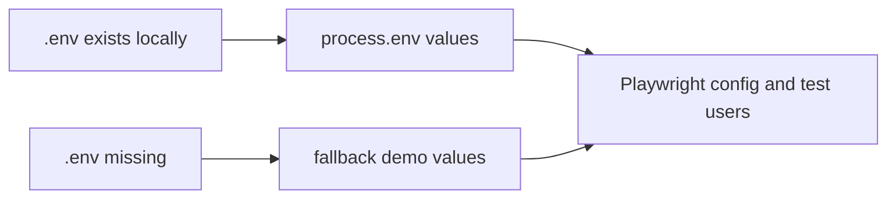

# Professional README

## The README Is A Contract

A README should not be a marketing page detached from the code. It is a contract between the repository and the reader.

When the README says "run this command," the command should exist in `package.json`. When it says the framework has page objects, the files should exist under `src/page-objects/`. When it says reports are generated, the report paths should match `playwright.config.ts`.

That is why Module 08 writes the README after the framework is built. The README can now describe the real project instead of guessing what the project might become.

## What The README Must Answer

The final `README.md` should help a new reader move from zero context to a working test run.



The README in this repository is organized around those steps:

| README Section | Why It Exists | Project Files It Connects To |
|---|---|---|
| Overview | Explains what the framework tests | `tests/`, `src/`, `playwright.config.ts` |
| Tech stack | Shows the major tools | `package.json`, `tsconfig.json` |
| Architecture | Explains how the framework is layered | `src/page-objects/`, `src/fixtures/`, `src/utils/`, `tests/` |
| Test inventory | Separates learning specs from capstone specs | `tests/learning/`, `tests/ui/`, `tests/api/`, `tests/ui/capstone/` |
| Getting started | Gives runnable setup steps | `package.json`, `.env.example` |
| Commands | Documents real npm scripts | `package.json` |
| Reports | Shows where generated reports live | `playwright.config.ts`, `reports/` |
| CI | Explains automated execution | `.github/workflows/playwright.yml` |
| Learning path | Connects modules to docs | `docs/module-*` |

## Truthful Metrics

Metrics are useful only when they are clear.

This project uses two different test counts:

- logical tests: the behaviors defined in spec files
- executions: the number of times Playwright runs those tests across projects

For example, Module 07 adds 88 logical UI capstone tests and 15 logical API-style capstone tests. The UI capstone tests run across Chromium, Firefox, and WebKit, so the capstone command produces 279 executions.

```text
88 UI logical tests x 3 browsers = 264 UI executions
15 API logical tests x 1 API project = 15 API executions
264 + 15 = 279 capstone executions
```

This is why the README says "103 logical capstone tests" and "`npm run test:capstone` runs 279 executions." Both are true, but they describe different things.

## How The README References Actual Scripts

The README should prefer project scripts over raw Playwright commands because scripts are easier for learners to remember.

Important scripts from `package.json` include:

| Script | Purpose |
|---|---|
| `npm run typecheck` | Runs TypeScript without executing tests |
| `npm run test:login` | Runs the focused login spec |
| `npm run test:smoke` | Runs tests tagged with `@smoke` |
| `npm run test:capstone` | Runs capstone UI and API coverage |
| `npm run test:capstone:ui` | Runs capstone UI coverage on desktop browsers |
| `npm run test:capstone:api` | Runs capstone API-style tests |
| `npm run test:ci` | Runs the full configured suite |
| `npm run report` | Opens the Playwright HTML report |
| `npm run test:reporting:allure` | Runs the reporting demo project and writes Allure results |
| `npm run allure:generate` | Builds the static Allure report |
| `npm run allure:open` | Opens the generated Allure report |

## Environment Documentation

The README should explain why the project can run without a local `.env` file.

The project has:

- `.env.example` as the safe template
- `.gitignore` rules that keep `.env` files out of Git
- `dotenv/config` imports in `playwright.config.ts` and `src/utils/test-users.ts`
- fallback values for SauceDemo's public demo URL and users

That means a learner can run the framework immediately, but the framework still demonstrates the correct real-world pattern.



In a company project, secrets should usually be required and injected through CI secrets. In this learning repo, the fallbacks are acceptable because SauceDemo uses public demo credentials.

## Avoiding README Drift

README drift happens when documentation keeps saying something that used to be true.

Common examples:

- command names changed but README still shows the old command
- test counts increased but README still shows the old count
- a report path moved but README still points to the old path
- a feature is described but no file implements it

Module 08 reduces drift by linking claims to files:

- test scripts come from `package.json`
- report paths come from `playwright.config.ts`
- framework structure comes from `src/` and `tests/`
- module descriptions come from `docs/module-*`

The practical rule is simple: if a README claim cannot be traced to code, config, or docs, either rewrite it or remove it.
