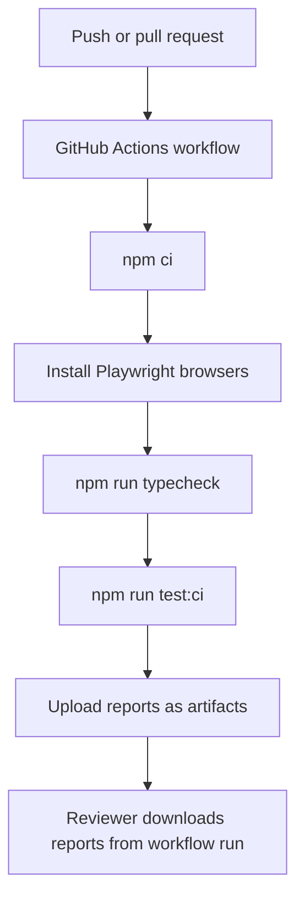

# GitHub And Report Packaging

## What GitHub Packaging Means

GitHub packaging is the work that helps a repository make sense before anyone opens an IDE.

For this project, that means:

- a clear repository description
- useful README sections
- accurate badges
- a visible CI workflow
- generated reports that are easy to find after a run
- ignored generated output so the repository stays clean

Packaging is not decoration. It reduces friction for the next person who tries to run or evaluate the framework.

## Suggested Repository Metadata

If this repository is made public, use metadata that describes the actual project.

Suggested description:

```text
Playwright and TypeScript UI automation framework for SauceDemo, built module-by-module with POM, fixtures, reporting, CI, and capstone coverage.
```

Suggested topics:

```text
playwright
typescript
test-automation
ui-testing
e2e-testing
sdet
page-object-model
allure-report
github-actions
saucedemo
```

These topics help the repository appear in relevant searches without overstating the project.

## Badges

Badges should be useful and truthful.

Good badge categories for this project:

- Playwright
- TypeScript
- GitHub Actions
- capstone test count

Static badges are fine for technology labels. Workflow badges are useful only when the repository is hosted on GitHub and the workflow path is correct.

The workflow file in this repo is:

```text
.github/workflows/playwright.yml
```

For a public GitHub repository, the workflow badge pattern is:

```markdown
[](https://github.com/<owner>/<repo>/actions/workflows/playwright.yml)
```

Do not leave `<owner>` and `<repo>` placeholders in a final public README. A broken badge makes the project look less maintained.

## Generated Reports

The reporting configuration lives in `playwright.config.ts`.

The framework writes several report formats:

| Output | Path | Purpose |
|---|---|---|
| Playwright HTML | `reports/playwright-html` | interactive local debugging |
| JSON results | `reports/test-results/results.json` | machine-readable test data |
| JUnit XML | `reports/test-results/junit.xml` | CI-compatible test summary |
| Allure raw results | `reports/allure-results` | source data for Allure |
| Allure static report | `reports/allure-report` | generated Allure HTML report |
| Artifacts | `reports/test-artifacts` | screenshots, videos, traces, attachments |

The raw and generated report folders are intentionally ignored by Git. Reports change on every run and can become large.

## How To Produce A Clean Report

For a clean Playwright and Allure reporting run:

```bash
rm -rf reports/allure-results reports/allure-report reports/playwright-html reports/test-results reports/test-artifacts
npm run test:ci
npm run allure:generate
npm run report
npm run allure:open
```

For a smaller Allure demonstration:

```bash
rm -rf reports/allure-results reports/allure-report
npm run test:reporting:allure
npm run allure:generate
npm run allure:open
```

The smaller command is useful when learning report generation. The full CI command is better when proving the completed framework.

## CI Artifact Flow

The GitHub Actions workflow uploads generated report folders as artifacts.



The workflow currently uploads:

```text
reports/playwright-html
reports/test-results
reports/allure-results
reports/test-artifacts
```

This is enough for CI review. GitHub Pages deployment is a separate enhancement because it requires repository settings and a publishing workflow.

## GitHub Pages Note

The source curriculum suggests publishing reports with GitHub Pages. That is a useful next step, but this module does not pretend it is already enabled.

To add it later, you would need to:

1. enable GitHub Pages in repository settings
2. decide which report to publish, usually Playwright HTML or generated Allure HTML
3. add a deployment workflow
4. verify that the published report does not expose secrets or unwanted artifacts

This project currently documents report generation and CI artifact upload, which are implemented and verifiable inside the repository.

## Keeping Generated Files Out Of Git

The `.gitignore` file protects the repository from generated output:

```text
reports/*
test-results/
playwright-report/
blob-report/
allure-results/
allure-report/
playwright/.auth/*
```

This matters because report files are evidence of a run, not source code. Keeping them out of Git keeps commits focused on framework changes.
