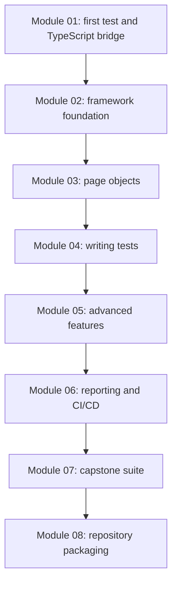
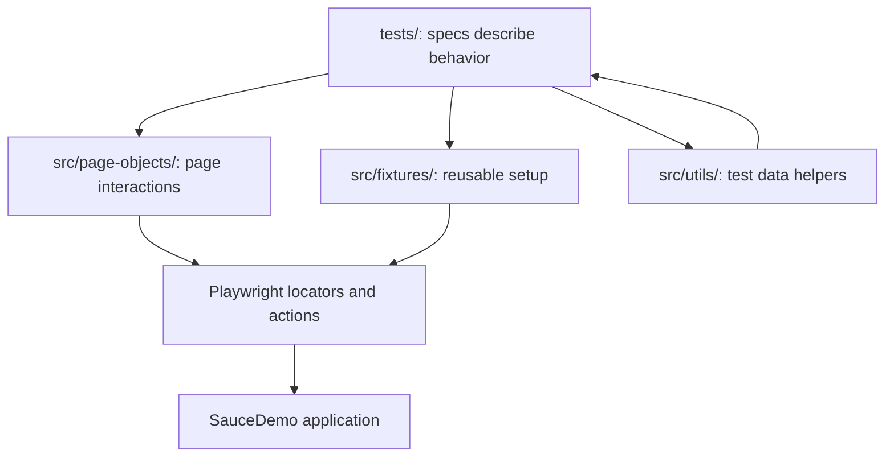

# Final Framework Review

## The Completed Framework

By Module 08, the repository has grown from a first Playwright check into a complete learning framework.

Module 08 is the point where the whole framework should read as one coherent project.

## Architecture Layers

The framework uses a layered structure.

The main rule is separation of responsibility:

- tests should explain the scenario and assertions
- page objects should know how to interact with pages
- fixtures should prepare reusable test state
- utilities should centralize shared data and simple helpers
- config should define projects, reporters, retries, output, and environment defaults

## Code Areas To Know

| Area | Files | What They Teach |
|---|---|---|
| Playwright configuration | [playwright.config.ts](../../playwright.config.ts) | projects, reporters, timeouts, traces, screenshots, base URL |
| TypeScript setup | [tsconfig.json](../../tsconfig.json) | strict typing and module configuration |
| Environment template | [.env.example](../../.env.example) | documented runtime variables |
| Page objects | `src/page-objects/*.ts` | reusable UI interaction layer |
| Fixtures | [src/fixtures/saucedemo-fixtures.ts](../../src/fixtures/saucedemo-fixtures.ts) | shared test setup and authenticated flows |
| Test users | [src/utils/test-users.ts](../../src/utils/test-users.ts) | typed environment-backed test user data |
| Capstone data | [src/utils/capstone-data.ts](../../src/utils/capstone-data.ts) | larger typed data set for Module 07 |
| UI specs | `tests/ui/**` | feature-oriented UI coverage |
| API specs | `tests/api/**` | Playwright request/API-style test examples |
| Advanced specs | `tests/advanced/**` | files, frames, dialogs, and network interception |
| Reporting spec | [tests/reporting/artifact-capture.spec.ts](../../tests/reporting/artifact-capture.spec.ts) | report attachment example |
| CI workflow | [.github/workflows/playwright.yml](../../.github/workflows/playwright.yml) | repeatable validation in GitHub Actions |

## Existing Tests Versus Capstone Tests

Earlier module tests are teaching examples. They introduce one idea at a time:

- first Playwright syntax
- login assertions
- product checks
- data-driven testing
- fixtures
- auth state
- file handling
- dialogs
- iframes
- network interception
- reporting artifacts

Capstone tests are broader. They prove the framework can support a larger suite organized by business area:

| Capstone Area | File | Logical Tests |
|---|---|---:|
| Authentication | [tests/ui/capstone/auth/login-capstone.spec.ts](../../tests/ui/capstone/auth/login-capstone.spec.ts) | 14 |
| Products | [tests/ui/capstone/products/products-capstone.spec.ts](../../tests/ui/capstone/products/products-capstone.spec.ts) | 24 |
| Cart | [tests/ui/capstone/cart/cart-capstone.spec.ts](../../tests/ui/capstone/cart/cart-capstone.spec.ts) | 23 |
| Checkout | [tests/ui/capstone/checkout/checkout-capstone.spec.ts](../../tests/ui/capstone/checkout/checkout-capstone.spec.ts) | 27 |
| API-style coverage | [tests/api/capstone/capstone-api.spec.ts](../../tests/api/capstone/capstone-api.spec.ts) | 15 |

The capstone suite reuses the existing page objects and data helpers. It does not create a second framework.

## Why There Is One Test In [tests/learning](../../tests/learning)

The [tests/learning/](../../tests/learning) folder is intentionally small. It belongs to Module 01 and exists for first contact with Playwright.

After Module 01, tests move into domain folders:

- [tests/ui/auth](../../tests/ui/auth)
- [tests/ui/products](../../tests/ui/products)
- [tests/ui/cart](../../tests/ui/cart)
- [tests/ui/checkout](../../tests/ui/checkout)
- [tests/api](../../tests/api)
- [tests/advanced](../../tests/advanced)
- [tests/reporting](../../tests/reporting)
- [tests/ui/capstone](../../tests/ui/capstone)

This prevents the beginner example from becoming mixed with production-style test organization.

## Final Validation Mindset

A completed framework should be reviewed from three angles:

1. Does it run?
2. Does it explain itself?
3. Does it avoid false claims?

For this repository, that means:

- `npm run typecheck` should pass
- `npm run test:ci` should pass
- README commands should exist in [package.json](../../package.json)
- report paths should match [playwright.config.ts](../../playwright.config.ts)
- docs should reference actual files
- generated artifacts should stay ignored
- `main` should point to the latest completed module tag

The final packaging is successful when someone can clone the project, follow the README, run tests, open reports, and understand why the code is organized the way it is.
