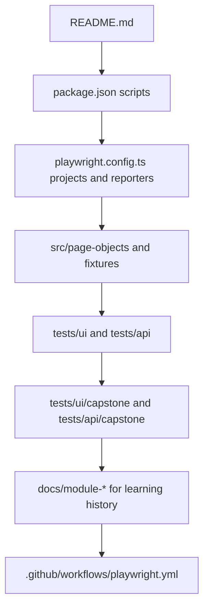

# Module 08 Framework Lifecycle Deep Dive

## Mental Model

Module 08 is not a feature module. It is the handoff layer.

By the end of Module 07, the framework already contains the technical work: page objects, fixtures, API-style tests, advanced Playwright examples, reporting, CI, and the capstone suite. Module 08 makes that work understandable to a reader who did not follow the whole course.

The finished repository has three audiences:

- A learner revisiting a module checkpoint.
- A reviewer evaluating whether the framework is organized and runnable.
- An interviewer asking how the framework was designed and why certain tradeoffs were made.

The mental model is simple: the README is the front door, the module docs are the guided tour, and the code/tests are the proof.

## Repository Reading Flow

A new reader should be able to move through the project in this order:



This flow matters because Module 08 packaging should reduce the time between "I opened the repository" and "I understand what this framework proves."

## Code And Documentation Walkthrough

Start with [README.md](../../README.md). It should answer the practical questions first:

- What does the project test?
- What stack does it use?
- How do I install dependencies?
- Which commands run focused, capstone, reporting, and CI suites?
- Where do reports go?
- How is the framework organized?

Then inspect [package.json](../../package.json). Every command mentioned in the README should exist here. For Module 08, especially verify:

- `npm run typecheck`
- `npm run test:login`
- `npm run test:smoke`
- `npm run test:capstone`
- `npm run test:capstone:ui`
- `npm run test:capstone:api`
- `npm run test:reporting:allure`
- `npm run test:ci`
- `npm run allure:generate`
- `npm run report`

Next read [playwright.config.ts](../../playwright.config.ts). This file proves the README's execution claims: browser projects, API project, advanced project, reporting project, auth setup project, authenticated project, reporters, output directories, retries, and artifacts.

Then inspect the framework layers:

- [src/page-objects](../../src/page-objects/BasePage.ts) proves the Page Object Model claim.
- [src/fixtures/saucedemo-fixtures.ts](../../src/fixtures/saucedemo-fixtures.ts) proves custom fixture support.
- [src/utils/test-users.ts](../../src/utils/test-users.ts) proves environment-backed user data.
- [src/utils/capstone-data.ts](../../src/utils/capstone-data.ts) proves the capstone data design.
- [tests/ui/capstone](../../tests/ui/capstone/auth/login-capstone.spec.ts) and [tests/api/capstone](../../tests/api/capstone/capstone-api.spec.ts) prove the capstone test inventory.
- [.github/workflows/playwright.yml](../../.github/workflows/playwright.yml) proves CI execution and artifact upload.

## TypeScript And Framework Syntax To Notice

Module 08 does not add new syntax-heavy framework code, but it asks you to explain the syntax already present across the repo.

Key examples to be ready for:

- `base.extend<SauceDemoFixtures>` creates typed Playwright fixtures.
- `dependencies: ['auth-setup']` makes saved-auth tests wait for setup.
- `testMatch` and `testIgnore` route specs to the correct projects.
- `as const satisfies readonly CapstoneProduct[]` checks immutable capstone data without losing literal types.
- `ApiResult<TBody>` demonstrates generic response typing in API-style tests.
- `testInfo.attach(...)` adds artifacts to reports.
- GitHub Actions `if: always()` preserves reports after failures.

If you are coming from Java:

- Page objects map to page-specific classes with behavior methods.
- Fixtures map to injected setup dependencies.
- TypeScript interfaces map to data contracts.
- Playwright reporters map to test listeners.
- GitHub Actions YAML maps to a CI pipeline definition.

## Responsibility Boundaries

The README should describe the finished framework, not teach every concept in depth. The module docs do the teaching.

The module docs should explain concepts at the checkpoint where they are introduced. They should not rewrite history by adding future concepts to early modules.

The code should remain the source of truth for behavior. Documentation should point to the code instead of making unsupported claims.

Generated reports should remain outside Git. The repository should explain how to generate them, while CI uploads them as run artifacts.

Portfolio language should be truthful. It is valid to say this is a production-style learning framework. It would be inaccurate to claim it is used in production or created business impact unless that is true outside the repo.

## Common Mistakes

Do not inflate test counts. Say "103 logical capstone tests" and explain executions separately.

Do not describe SauceDemo API coverage as real ecommerce API integration. The capstone API tests are API-style contract exercises built from local data.

Do not leave README commands that do not exist in [package.json](../../package.json).

Do not commit reports, videos, screenshots, traces, auth state, or local `.env` files.

Do not add standalone resume or recruiter-message files just because the source curriculum mentions them. This repository keeps packaging inside the project.

Do not make Module 08 sound like it added new framework capabilities. It packages the capabilities already built through Module 07.

## Debugging And Failure Model

When packaging docs drift, debug them like tests:

1. Find the claim.
2. Trace it to a file.
3. Run the command if the claim is executable.
4. Fix the claim or the implementation, depending on which one is wrong.

Examples:

- A script claim should trace to [package.json](../../package.json).
- A report path should trace to [playwright.config.ts](../../playwright.config.ts).
- A CI claim should trace to [.github/workflows/playwright.yml](../../.github/workflows/playwright.yml).
- A capstone count should trace to spec files under [tests/ui/capstone](../../tests/ui/capstone/auth/login-capstone.spec.ts) and [tests/api/capstone](../../tests/api/capstone/capstone-api.spec.ts).

Useful final verification commands:

```bash
npm run typecheck
npm run test:reporting:allure
npm run test:capstone:api
npm run test:ci
```

For a faster documentation audit, run:

```bash
rg -n "npm run|reports/|module-[0-9][0-9]-complete" README.md docs/module-08-portfolio-and-interview-packaging package.json playwright.config.ts
```

## Interview Readiness

A strong high-level project explanation is:

"I built a Playwright and TypeScript UI automation framework module by module. It starts with raw Playwright tests, then adds configuration, environment-backed data, page objects, structured and data-driven tests, custom fixtures, saved authentication state, advanced browser features, reporting, CI, and finally a 103-logical-test capstone suite. The repository preserves each module as a branch and tag so the learning history is inspectable."

Be ready to defend these design decisions:

- Why page objects were introduced after raw specs.
- Why credentials are centralized in typed utilities.
- Why capstone data is centralized instead of repeated in specs.
- Why UI and API-style tests are separated by project.
- Why auth state reuse does not replace login tests.
- Why generated reports are uploaded by CI but ignored by Git.
- Why Module 08 packages the project without adding new test behavior.

Resume-style talking points should stay factual:

- Built a Playwright + TypeScript UI automation framework for SauceDemo with Page Object Model, typed data, fixtures, reporting, and GitHub Actions CI.
- Designed a capstone regression suite covering authentication, products, cart, checkout, and API-style contract checks.
- Configured Playwright HTML, JSON, JUnit, and Allure reporting with CI artifact upload for failure review.

Use those as talking points, not as claims of professional production usage.

## Revision Checklist

Before calling the course complete, confirm:

- The README commands exist in [package.json](../../package.json).
- The report paths match [playwright.config.ts](../../playwright.config.ts).
- The CI workflow runs typecheck and `npm run test:ci`.
- The capstone counts are stated as logical tests versus executions.
- Generated report and auth-state folders are ignored.
- Module docs link to files that exist at the final checkpoint.
- `CLAUDE.md` and `AGENTS.md` remain mirrored if either instruction file changes.
- `main` points to the final Module 08 checkpoint after completion.
- `module-08-complete` points to the same enhanced checkpoint.
